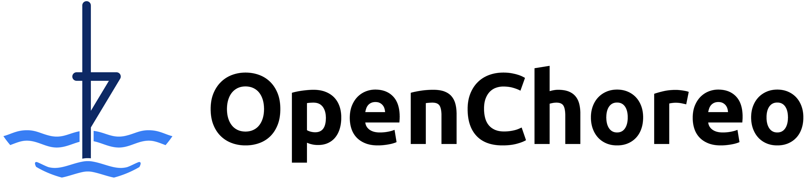
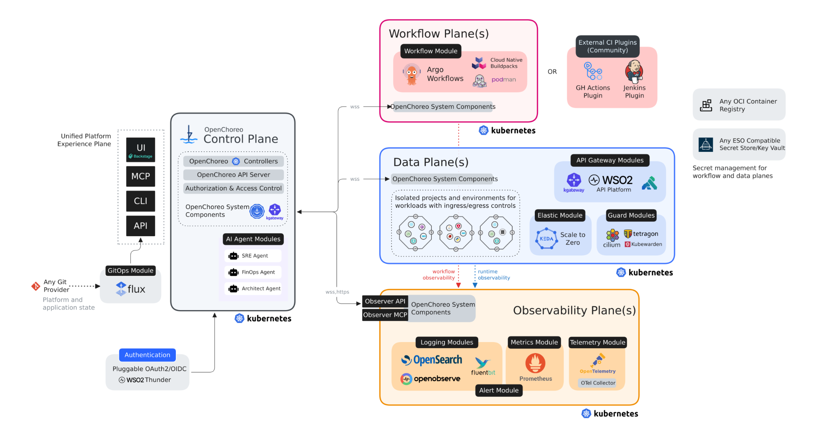

   
  <picture>
    <source media="(prefers-color-scheme: dark)" srcset="./docs/images/openchoreo-horizontal-white.png">
    
  </picture>

  <h1>
    A complete, open-source developer platform for Kubernetes
  </h1>
  <h2>
    Ready to use on day one, built to integrate with your stack
  </h2>

<!-- License & Community -->

<!-- Security & Compliance -->

<!-- Build, Quality & Project Info -->

## What is OpenChoreo?

OpenChoreo is a developer platform for Kubernetes offering development and architecture abstractions, a Backstage-powered developer portal, application CI/CD, GitOps, RBAC and observability.

OpenChoreo orchestrates Kubernetes and other CNCF and open-source projects as a domain-driven, API-first platform to give platform teams a strong head start. You can use it as-is, or tailor it to fit your own Internal Developer Platform (IDP) vision.

<picture>
  
</picture>

## Key features

- **Modular, multi-plane platform architecture**

  Independently deployable control, data, build, and observability planes separate concerns with clear boundaries and flexible deployment topologies, from a single Kubernetes cluster to massively distributed fleets.

- **Platform abstractions (APIs) as building blocks**
  
  Core platform concepts are exposed as declarative APIs (environments, gateways, pipelines/workflows, component types, modules, etc.), so topology and delivery behavior can be standardized across an organization.

- **Programmable developer abstractions**

  Developers use higher-level, extensible Kubernetes-native abstractions (projects, components, endpoints, dependencies) and golden paths to ship without dealing with the full surface area of the Kubernetes API.

- **Intelligent, integrated observability**

  Unified access to distributed logs, metrics, traces, and alerts and exposed via APIs. A unified platform model enriched with observability data allows for faster debugging and operational actions for humans and AI.

- **Built-in agents**

  Agents are first-class platform citizens.
  Includes an SRE agent for root cause analysis and remediation, a FinOps agent for cost optimization, and more.

- **AI-assisted/driven engineering and operations**

  A controlled agent interface with MCP servers, skills, and the CLI lets AI assistants and agents participate in development, delivery, and operations, without bypassing guardrails.

- **GitOps: Declarative platform + app state**

  Platform and application state are reconciled from Git for auditability and drift resistance, with GUI and CLI support for imperative actions when speed matters (or if that's what you prefer).

- **Multi-tenancy and access controls**

  Built-in tenancy boundaries and role-based access control enable safe self-service across teams, projects, and environments with least-privilege access.

- **Modules catalog**

  Integrate external tools into OpenChoreo's unified platform experience using community-driven marketplace modules, or build your own.

## Documentation

OpenChoreo's documentation is available at [openchoreo.dev](https://openchoreo.dev).

## Getting Started

The easiest way to try OpenChoreo is by following the **[Quick Start Guide](https://openchoreo.dev/docs/getting-started/quick-start-guide/)**. 

Visit the **[Installation Guides](https://openchoreo.dev/docs/category/try-it-out/)** to learn more about installing OpenChoreo on Kubernetes for further evaluation and production use.

For a deeper understanding of OpenChoreo's architecture, see **[OpenChoreo Architecture](https://openchoreo.dev/docs/overview/architecture)** and **[OpenChoreo Concepts](https://openchoreo.dev/docs/category/concepts/)**.

## Join the Community & Contribute

We’d love for you to be part of OpenChoreo’s journey! 
Whether you’re fixing a bug, improving documentation, or suggesting new features, every contribution counts.

- **[Contributor Guide](./docs/contributors/README.md)** – Learn how to get started.
- **[Report an Issue](https://github.com/openchoreo/openchoreo/issues)** – Help us improve Choreo.
- **[Join our Slack](https://cloud-native.slack.com/archives/C0ABYRG1MND)** – Be part of the community.

We’re excited to have you onboard!

## Roadmap

We maintain an OpenChoreo Roadmap as a GitHub project board to share what we’re building and when we expect to deliver it.

See the [OpenChoreo Roadmap](https://github.com/orgs/openchoreo/projects/5/views/2)

### How It Works

- **Backlog**: New tasks are added to the [Backlog](https://github.com/orgs/openchoreo/projects/5/views/1) and are prioritized by the OpenChoreo team
- **GitHub discussions**: OpenChoreo is designed in the open. [GitHub discussions](https://github.com/openchoreo/openchoreo/discussions) are used to discuss and review new features and improvements
- **Release management**: Epics that track the progress of a high-level task is assigned to a planned release in the [roadmap](https://github.com/orgs/openchoreo/projects/5/views/2)

## License
OpenChoreo is licensed under Apache 2.0. See the **[LICENSE](./LICENSE)** file for full details.

---

  <h2>OpenChoreo is a <a href="https://www.cncf.io/">CNCF</a> Sandbox Project</h2>
  <picture>
    <source media="(prefers-color-scheme: dark)" srcset="./docs/images/cncf-logo-white.png">
    
  </picture>

