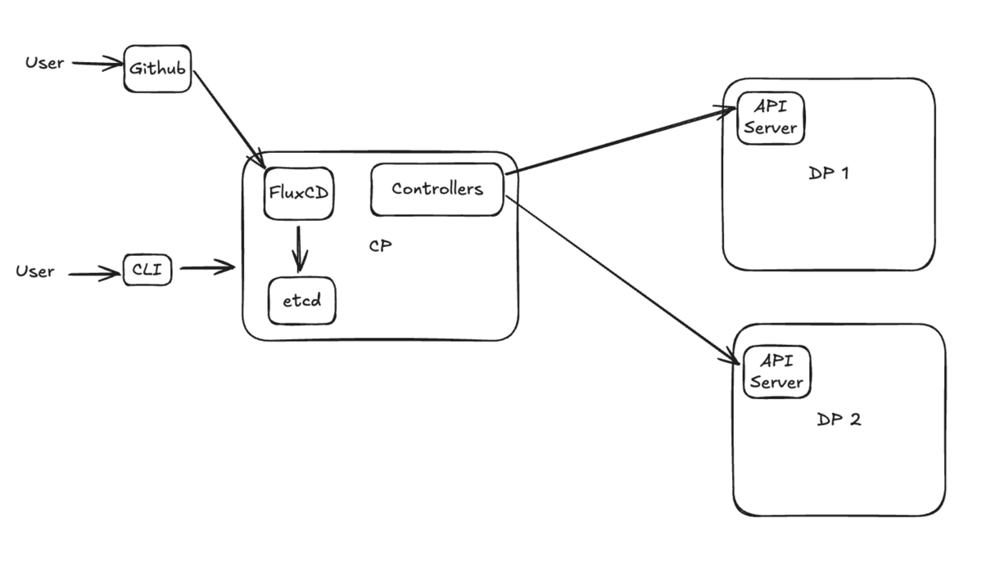
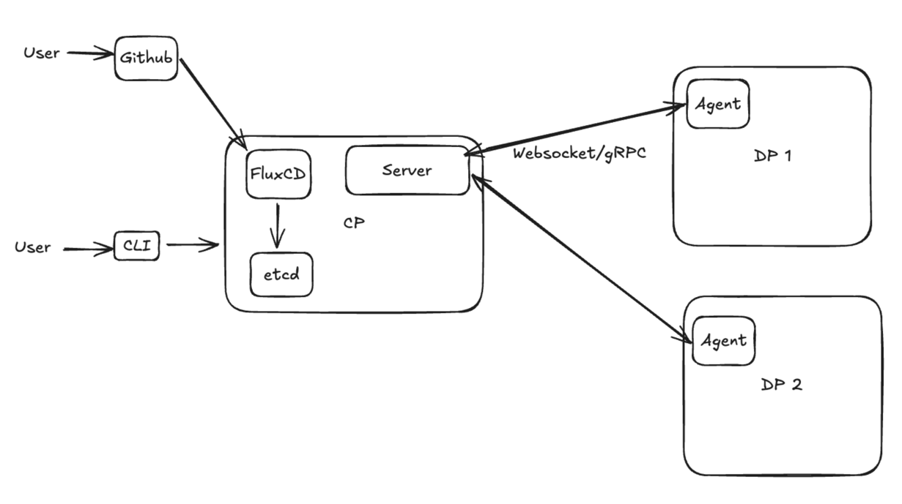
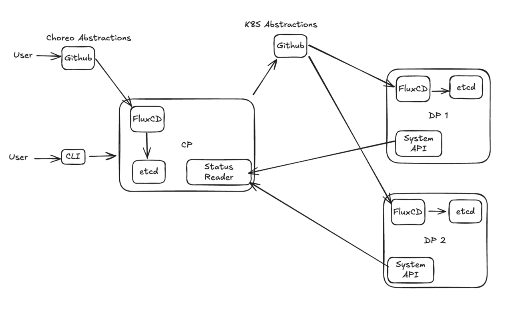

# Control Plane and Data Plane Separation

**Authors**:
@chalindukodikara

**Reviewers**:
@Mirage20
@sameerajayasoma

**Created Date**:
2025-04-10

**Status**:
Approved

**Related Issues/PRs**:
https://github.com/openchoreo/openchoreo/issues/159

---

## Summary

This proposal addresses the architectural separation of OpenChoreo's Control Plane (CP) and Data Plane (DP) to enable
multi-cluster deployments. Currently, both CP and DP reside within the same Kubernetes cluster, limiting deployment
flexibility. This proposal introduces multiple approaches for secure, efficient communication between a centralized
Control Plane and multiple distributed Data Planes across different Kubernetes clusters.

---

## Motivation

In real-world scenarios, user deployments may span across multiple Data Planes hosted on various Kubernetes
clusters—either self-managed or provided by different cloud vendors. The current architecture, where CP and DP coexist
in the same cluster, cannot support these multi-cluster deployments.

Solving this problem will introduce a key feature required for an Internal Developer Platform (IDP), adding substantial
value to OpenChoreo and its users by enabling:

- Geographic distribution of workloads
- Multi-cloud deployments
- Enhanced security through network isolation
- Better resource utilization and scaling

---

## Goals

1. Establish a **lightweight and secure communication mechanism** between CP and DPs
2. Ensure the **desired state** is applied and the **actual state** is retrievable from DPs
3. **Reconcile resources** when changes are detected in DPs
4. Ensure that **status updates** are reconciled from the Control Plane, maintaining it as the single source of truth (
   etcd in CP)
5. **Minimize the resource load** on Data Planes

---

## Impact

- **Control Plane Controllers**: Will need modifications to support remote Data Plane communication
- **DataPlane CRD**: Will require updates to store connection credentials and configuration
- **CLI/UI**: May need updates to display multi-cluster status information
- **Installation**: New deployment models for separated CP/DP architecture
- **Security**: New authentication and authorization mechanisms for CP-DP communication

---

## Design

### Solution Overview

This proposal presents three main approaches for CP-DP separation, each with different trade-offs:

### Solution 1: Direct Control Plane Access to Data Plane

In scenarios where CP and DP exist within the same virtual network (local setups or cloud VPCs), the Control Plane can
directly access the Data Plane using its credentials.

**Advantages:**

- Easier to implement and test in local environments
- Ideal for development setups
- No additional components required

**Considerations:**

- Users might be reluctant to expose DP API server
- HTTP calls might be slower than persistent connections
- Each resource call directly hits the API server
- Requires periodic reconciliation to detect changes

#### Solution 1.1: Extending to Cloud with Mesh Networking

Use Tailscale or similar mesh networking solutions to securely expose DP clusters to CP without public API server
exposure.

**Advantages:**

- Secure exposure of DP API server
- Works across network boundaries
- No public endpoint exposure required

#### Solution 1.2: Agent-Based Communication Model

A more scalable option using an agent-based communication model where:

1. Users apply resources to the Control Plane via CLI or UI
2. Control Plane controllers communicate with agents over persistent WebSocket/gRPC channels
3. Agents running in Data Planes connect to the CP server
4. CP applies and reads YAML manifests through the agent connection

**Advantages:**

- Proven architecture (already in use within Choreo)
- More secure and cloud-friendly
- Pull-based model (agents initiate connection)
- Works across any network topology

### Solution 2: GitOps with Secondary Repository

This approach uses a secondary GitHub repository for generated Kubernetes YAML manifests:

1. Users store OpenChoreo abstractions in one repository
2. CP generates Kubernetes YAMLs and stores them in a secondary repository
3. FluxCD in the Data Plane periodically retrieves and applies these resources

**Advantages:**

- Reconciliation offloaded to FluxCD
- Additional version control and rollback capability
- GitOps-native approach

**Considerations:**

- Still requires reading cluster status (via agent or API)
- Additional complexity in managing secondary repository
- Requires structured YAML organization (folders/branches per project/component/environment)
- Local setup requires GitHub repository

### Agent-Based Communication Implementation Options

If adopting Solution 1.2 or Solution 2, we need an agent-based communication model. Options include:

#### Option 1: Custom Implementation

Build our own WebSocket/gRPC-based agent system tailored to OpenChoreo's needs.

#### Option 2: ClusterNet

[ClusterNet](https://clusternet.io/docs/introduction/) provides cluster management capabilities:

- Deploy and coordinate applications to multiple clusters
- Single set of APIs in hosting cluster
- Built-in agent system

#### Option 3: Open Cluster Management (OCM)

[Open Cluster Management](https://open-cluster-management.io/docs/concepts/architecture/) provides:

- **Hub Cluster**: Lightweight cluster hosting controllers and services
- **Klusterlet**: Agent that pulls prescriptions from hub and reconciles managed clusters
- Pull-based model where managed clusters reach out to hub

Since ClusterNet and OCM can directly reconcile the DP cluster, secondary GitHub storage becomes unnecessary.

---

## Recommendation

**Solution 1 (Direct Access)** has been implemented as the initial approach, which provides a solid foundation for local development and environments where CP and DP share network connectivity.

For future enhancements to support more complex deployment scenarios, we recommend **Solution 1.2 (Agent-Based Communication Model)** with **Option 3 (Open Cluster Management)** as the agent framework. This would provide:

1. **Security**: Pull-based model where Data Planes initiate connections
2. **Flexibility**: Works across any network topology without exposing API servers
3. **Maturity**: OCM is a CNCF project with proven stability
4. **Extensibility**: Can be enhanced with GitOps patterns later if needed
5. **Backward Compatibility**: Can coexist with the current direct access implementation

The direct access implementation serves as the foundation, with agent-based communication as the natural evolution for production multi-cluster deployments.

---

## Implementation Plan

Issue: https://github.com/openchoreo/openchoreo/issues/188

1. **Phase 1**: Implement direct access for local development
2. **Phase 2**: Integrate Open Cluster Management for agent-based communication
3. **Phase 3**: Add support for multiple Data Planes per Control Plane
4. **Phase 4**: Optional GitOps integration for users who prefer that workflow
