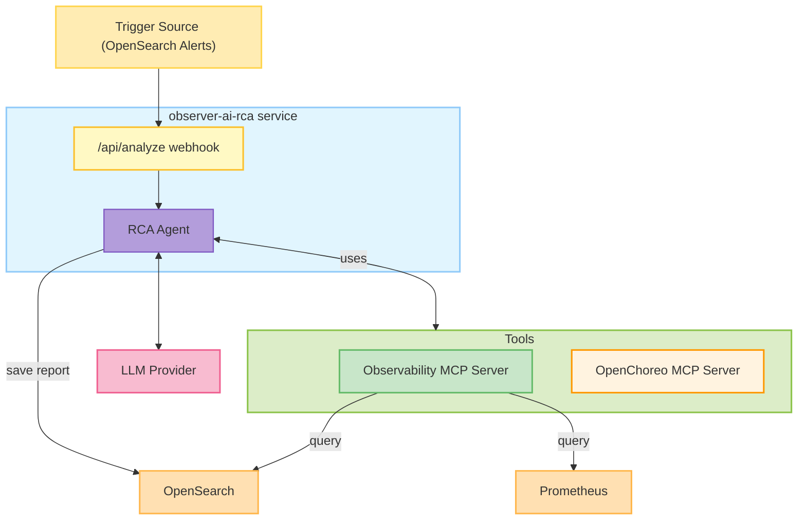
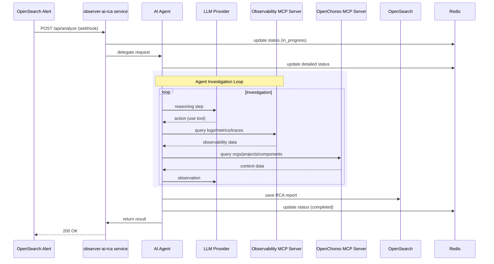

# Introduce AI RCA Agent for OpenChoreo

**Authors**:
_@rashadism_

**Reviewers**:
_@lakwarus, @manjulaRathnayaka, @sameerajayasoma, @binura-g, @Mirage20

**Created Date**:
_2025-11-03_

**Status**:
_Submitted_

**Related Issues/PRs**:
_https://github.com/openchoreo/openchoreo/issues/527_<br>
_https://github.com/openchoreo/openchoreo/issues/555_<br>
_https://github.com/openchoreo/openchoreo/issues/573_<br>

---

## Summary

Introduce AI-powered automated root cause analysis (RCA) to reduce MTTR during incidents by automatically correlating logs, traces, and metrics. This feature integrates with OpenSearch alerting and can be configured to automatically trigger RCA for specific alerts (opt-in), or can be manually triggered from the alert view. RCA generates reports that include likely root causes, supporting evidence, and possible remediation steps. Reports are stored in OpenSearch, and RCA execution metadata is tracked in Redis alongside alerts, viewable through Backstage or the CLI.

---

## Motivation

Manual incident investigation requires hours of correlating observability data. Automated RCA provides developers and platform engineers a substantial head start in addressing incidents, reducing downtime and operational burden.

---

## Goals

- Automate incident investigation by correlating logs, traces, and metrics
- Generate structured JSON RCA reports stored in OpenSearch
- Integrate with existing observability tools (OpenSearch, Prometheus) via MCP
- Support multiple LLM providers (OpenAI, Anthropic, Azure OpenAI, Google GenAI)

---

## Non-Goals

- Automatic incident remediation (diagnostic only)
- Custom tool integration beyond MCP servers (initial focus: OpenSearch, Prometheus via Observability MCP)
- Performance monitoring/data collection
- Build-time issue analysis (focused on runtime/production issues)

---

## Impact

**Affected Components:**
- Observability plane: New RCA service (`observer-ai-rca`) deployed as addon with a webhook endpoint
- OpenSearch: RCA report storage, logs storage
- Redis: RCA execution metadata storage

**Backward Compatibility:** Fully compatible. Optional feature deployed as separate addon service, no breaking changes.

---


## Design

### Overview

The AI-powered RCA agent operates as an optional service (`observer-ai-rca`) within the observability plane. OpenSearch alerts POST to the RCA service's webhook endpoint when triggered. Users can opt in to enable automatic RCA for specific alerts, or manually trigger RCA from the alert view in Backstage/CLI. The RCA service delegates requests to an AI agent that investigates incidents using MCP server tools to query logs, metrics, and traces through the Observability MCP server, and organizational context through the OpenChoreo MCP server. The final RCA report is stored in OpenSearch as JSON. RCA execution statuses are persisted in Redis alongside alerts, enabling users to view RCA progress and results through Backstage or the CLI. Completed RCAs can be retriggered with additional context for deeper investigation.

**Key Design Decisions:**

- **Service deployment**: Runs as a separate service in the observability plane with a Webhook endpoint
- **MCP-based tools**: Agent uses Observability MCP server for logs/metrics/traces and OpenChoreo MCP server for organizational context
- **OpenSearch for reports**: RCA reports stored in OpenSearch alongside logs and traces
- **Multi-provider LLM support**: Supports OpenAI, Anthropic, Azure OpenAI, and Google GenAI via helm configuration
- **External Secrets support**: Can fetch LLM API keys from external secret stores via External Secrets Operator

### Architecture



### Execution Flow

A successful RCA run follows this sequence:



### API Design

#### POST /api/analyze

Webhook endpoint for triggering RCA analysis. Called by OpenSearch alerts (for opt-in automatic RCA) or manually triggered from Backstage/CLI alert view.

**Request:**
```json
{
  "rca_id": "rca-123456",
  "metadata": {
    "project_id": "my-project",
    "component_id": "my-component",
    "environment": "production",
    "timestamp": "2025-11-03T10:00:00Z",
    "alert_id": "alert-789",
    "rule": "5xx_burst"
  },
  "context": {
    "additional_context": "Optional user-provided context for retriggering"
  }
}
```

**Response (202 Accepted):**
```json
{
  "rca_id": "rca-123456",
  "status": "in_progress",
  "message": "RCA analysis started",
  "started_at": "2025-11-03T10:00:05Z"
}
```

**Error Responses:**
- `400 Bad Request`: Invalid request format or missing required fields
- `503 Service Unavailable`: RCA service not healthy or LLM provider unreachable

### Installation and Configuration

#### Prerequisites

- OpenChoreo Observability Plane must be installed in the target namespace
- Observer service must be running
- OpenChoreo API must be running in the control plane
- LLM API credentials (Anthropic, OpenAI, Azure OpenAI, or Google GenAI)

#### Installation

The RCA agent is deployed as a helm addon to the observability plane. LLM provider configuration is required during installation.

**Example installation with OpenAI:**

```bash
helm install rca-agent install/helm/openchoreo-observability-plane/addons/rca \
  --namespace openchoreo-observability-plane \
  --set rcaService.llm.apiKey="sk-proj-your-api-key" \
  --set rcaService.llm.provider="openai" \
  --set rcaService.llm.modelName="gpt-5"
```

**Installation with External Secrets:**

```bash
# Ensure your ClusterSecretStore exists and contains the LLM API key
helm install rca-agent install/helm/openchoreo-observability-plane/addons/rca \
  --namespace openchoreo-observability-plane \
  --set rcaService.llm.externalSecret.enabled=true \
  --set rcaService.llm.externalSecret.secretStoreRef="prod-vault-store" \
  --set rcaService.llm.externalSecret.apiKeyRef.key="llm/anthropic" \
  --set rcaService.llm.externalSecret.apiKeyRef.property="apiKey" \
  --set rcaService.llm.provider="anthropic" \
  --set rcaService.llm.modelName="claude-sonnet-4-5"
```

#### LLM Provider Configuration

The RCA agent currently supports four LLM providers, configured via helm values:

| Provider | Value | Required Fields |
|----------|-------|----------------|
| Anthropic Claude | `anthropic` | `apiKey`, `modelName` |
| OpenAI | `openai` | `apiKey`, `modelName` |
| Azure OpenAI | `azureopenai` | `apiKey`, `modelName`, `azure.endpoint`, `azure.apiVersion`, `azure.deployment` |
| Google GenAI | `googlegenai` | `apiKey`, `modelName` |


**Configuration Files:**

The installation creates the following resources:
- **ConfigMap** (`<release-name>-openchoreo-observer-rca-llm-config`): Stores provider, model name, and Azure-specific configuration
- **Secret** (`<release-name>-openchoreo-observer-rca-llm-secret`): Stores API key (when not using external secrets)
- **ExternalSecret** (`<release-name>-openchoreo-observer-rca-llm-secret`): Fetches API key from ClusterSecretStore (when external secrets enabled)

#### MCP Endpoint Discovery

The RCA service deployment includes environment variables for MCP endpoint auto-discovery:
- `OBSERVER_MCP_URL`: Defaults to `http://observer.openchoreo-observability-plane.svc.cluster.local:8080/mcp`
- `OPENCHOREO_MCP_URL`: Defaults to `http://openchoreo-api.openchoreo-control-plane.svc.cluster.local:8080/mcp` (Single cluster)

These can be overridden in `values.yaml` for multi-cluster setups.

---

## Conclusion

This proposal introduces an AI-powered RCA agent as an optional observability plane addon that automates incident investigation through intelligent correlation of logs, traces, and metrics. By leveraging MCP-based tooling and multi-provider LLM support, the system provides developers with actionable insights to reduce MTTR while maintaining full backward compatibility with existing OpenChoreo deployments.
