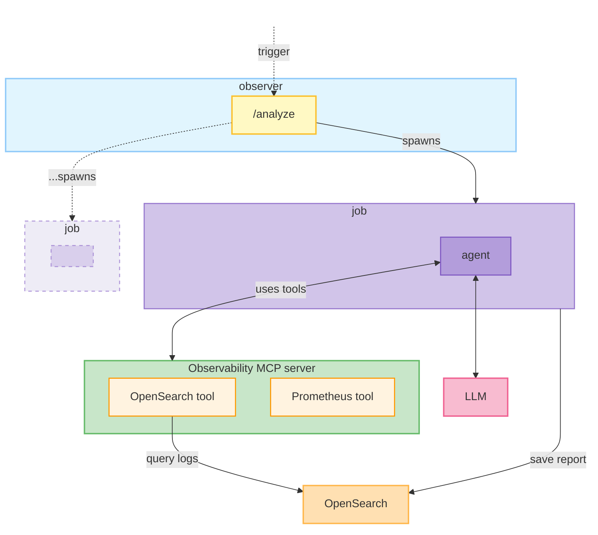
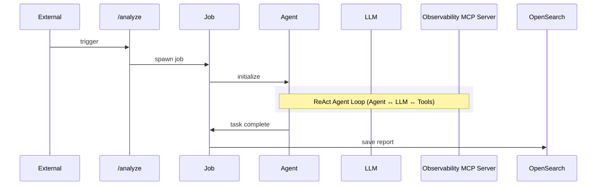

# Title

**Authors**:  
_@rashadism_

**Reviewers**:  
_@lakwarus, @manjulaRathnayaka, @sameerajayasoma, @binura-g, @Mirage20

**Created Date**:  
_2025-11-03_

**Status**:  
_Submitted_

**Related Issues/PRs**:  
_https://github.com/openchoreo/openchoreo/issues/527_<br>
_https://github.com/openchoreo/openchoreo/issues/555_<br>
_https://github.com/openchoreo/openchoreo/issues/573_<br>

---

## Summary

Introduce AI-powered automated root cause analysis (RCA) to reduce MTTR during incidents by automatically correlating logs, traces, and metrics. This feature can be triggered on incidents via alerting (https://github.com/openchoreo/openchoreo/issues/685) and generates reports that include likely root causes, supporting evidence, and possible remediation steps. Reports are stored in OpenSearch and can be viewed through Backstage or the CLI via the alerting view.

---

## Motivation

Manual incident investigation requires hours of correlating observability data. Automated RCA provides developers and platform engineers a substantial head start in addressing incidents, reducing downtime and operational burden.

---

## Goals

- Automate incident investigation by correlating logs, traces, and metrics
- Generate structured JSON RCA reports stored in OpenSearch
- Integrate with existing observability tools (OpenSearch, Prometheus) via MCP
- Optional, opt-in feature with ResourceQuota-based throttling
- Support multiple LLM providers (OpenAI, Anthropic, Azure OpenAI etc)

---

## Non-Goals

- Guaranteed RCA for every incident (ResourceQuota may reject requests)
- Automatic incident remediation (diagnostic only)
- Custom tool integration (initial focus: OpenSearch, Prometheus)
- Performance monitoring/data collection

---

## Impact

**Affected Components:**
- Observability plane: New `/api/analyze` endpoint, jobs in `openchoreo-rca-jobs` namespace, RCA execution status in Redis (alerts already persisted via https://github.com/openchoreo/openchoreo/issues/685)
- OpenSearch: RCA report storage

**Backward Compatibility:** Fully compatible. Optional feature, no breaking changes.

---


## Design

### Overview

The AI-powered RCA system operates as an optional component within the observability plane. When triggered via the `/api/analyze` endpoint, the system spawns a Kubernetes Job that runs an AI agent. The agent uses LLM-powered reasoning (ReAct) equipped with MCP server tools to investigate incidents by querying logs, metrics, and other observability data. The final RCA report is stored in OpenSearch as JSON. RCA execution status is persisted in Redis alongside alerts (which are already stored in Redis via https://github.com/openchoreo/openchoreo/issues/685), enabling users to view RCA progress and results through Backstage or the CLI via the alerting view.

**Key Design Decisions:**

- **Kubernetes Jobs over in-process goroutines**: Provides language flexibility (Python for agent development), resource isolation, and prevents long-running agents from exhausting service resources
- **MCP servers for tool integration**: Leverages MCP for standardized tool integration with observability (OpenSearch, Prometheus) and control plane systems
- **OpenSearch for report storage**: Treats RCA reports as historical observability data, avoiding etcd overload and tight Kubernetes coupling
- **ResourceQuota-based throttling**: Limits concurrent jobs to prevent API server overload and control costs during burst scenarios
- **No CRD approach**: Avoids tight Kubernetes coupling, potential user data in control plane, and etcd scaling concerns

### Architecture


```mermaid
graph TD
    subgraph service["observer"]
        analyze["/analyze"]
    end

    subgraph obs_service["Observability MCP server"]
        opensearch_tool["OpenSearch tool"]
        prometheus_tool["Prometheus tool"]
    end

    subgraph jobs1["job"]
        agent1["agent"]
    end

    subgraph jobs3["job"]
        agent3[" "]
    end

    os[OpenSearch]
    llm[LLM]
    external[ ]

    external -.->|trigger| analyze
    analyze -->|spawns| jobs1
    analyze -.->|...spawns| jobs3

    jobs1 --> |save report|os

    agent1 <-->|uses tools| obs_service
    agent1 <--> llm

    opensearch_tool --> |query logs|os

    %% Styles
    style service fill:#e1f5fe,stroke:#90caf9,stroke-width:2px,rounded-corners:8px
    style obs_service fill:#c8e6c9,stroke:#66bb6a,stroke-width:2px,rounded-corners:8px
    style jobs1 fill:#d1c4e9,stroke:#9575cd,stroke-width:1.5px
    style jobs3 fill:#e8e4f3,stroke:#9575cd,stroke-width:1.5px,stroke-dasharray:5 5,opacity:0.7
    style os fill:#ffe0b2,stroke:#ffb74d,stroke-width:2px
    style analyze fill:#fff9c4,stroke:#fbc02d,stroke-width:2px
    style agent1 fill:#b39ddb,stroke:#7e57c2,stroke-width:1.5px
    style agent3 fill:#d1c4e9,stroke:#9575cd,stroke-width:1.5px,stroke-dasharray:5 5,opacity:0.7
    style external fill:transparent,stroke:transparent
    style opensearch_tool fill:#fff3e0,stroke:#ff9800,stroke-width:1.5px
    style prometheus_tool fill:#fff3e0,stroke:#ff9800,stroke-width:1.5px
    style llm fill:#f8bbd0,stroke:#f06292,stroke-width:2px
```

### Execution Flow

A successful RCA run follows this sequence:


```mermaid
sequenceDiagram
    participant External
    participant Analyze as /analyze
    participant Job
    participant Agent
    participant LLM
    participant ObsServer as Observability MCP Server
    participant OS as OpenSearch

    External->>Analyze: trigger
    Analyze->>Job: spawn job
    Job->>Agent: initialize

    rect rgb(240, 240, 255)
        Note over Agent,ObsServer: ReAct Agent Loop (Agent ↔ LLM ↔ Tools)
    end

    Agent->>Job: task complete
    Job->>OS: save report
```

### API Design

#### POST /api/analyze

Triggers an RCA job for a specific incident.

**Request:**
```json
{
  "rca_id": "rca-123456",
  "metadata": {
    "project_id": "my-project",
    "component_id": "my-component",
    "environment": "production",
    "timestamp": "2025-11-03T10:00:00Z",
    "alert_id": "alert-789",
    "rule": "5xx_burst"
  }
}
```

**Response (201 Created):**
```json
{
  "jobName": "rca-rca-123456",
  "jobNamespace": "openchoreo-rca-jobs",
  "status": "Created",
  "createdAt": "2025-11-03T10:00:05Z",
}
```

**Error Responses:**
- `400 Bad Request`: Invalid request format or missing required fields
- `429 Too Many Requests`: ResourceQuota exceeded
- `503 Service Unavailable`: RCA feature not enabled

### Installation and Configuration

#### Installation Flow

The AI-Powered RCA feature is optional and must be explicitly enabled. There are two installation paths:

1. **Fresh installation**: Enable the RCA feature during initial observability plane installation via a feature flag, then configure the LLM settings
2. **Existing installation**: If the observability plane is already deployed, enable the RCA feature by performing a `helm upgrade` with the RCA feature flag enabled

#### LLM Configuration

The RCA feature requires configuration of an LLM provider. The following parameters must be configured:

**Required for all providers:**
- `RCA_LLM_PROVIDER`: The LLM provider (e.g., `openai`, `anthropic`, `azureopenai`)
- `RCA_MODEL_NAME`: The model to use (e.g., `gpt-4o`, `claude-sonnet-4-5`)
- `RCA_LLM_API_KEY`: Provider API key (stored as a Kubernetes Secret)

**Azure OpenAI specific (optional, only when provider is `azureopenai`):**
- `RCA_AZURE_API_VERSION`: API version (e.g., `2024-02-15-preview`)
- `RCA_AZURE_DEPLOYMENT`: Azure deployment name

To configure the LLM, apply the following manifests to your cluster:

```yaml
---
apiVersion: v1
kind: Secret
metadata:
  name: observability-rca-llm-secret
  namespace: openchoreo-observability-plane
type: Opaque
stringData:
  RCA_LLM_API_KEY: "sk-ant-your-api-key-here"  # Replace with your actual API key

---
apiVersion: v1
kind: ConfigMap
metadata:
  name: observability-rca-llm-config
  namespace: openchoreo-observability-plane
data:
  RCA_LLM_PROVIDER: "anthropic"  # Options: openai, anthropic, azureopenai
  RCA_MODEL_NAME: "claude-sonnet-4-5"

  # Azure OpenAI specific (optional, only required when LLM_PROVIDER is azureopenai)
  # RCA_AZURE_API_VERSION: "2024-02-15-preview"
  # RCA_AZURE_DEPLOYMENT: "my-gpt4-deployment"
```

**Note:** If using External Secrets Operator or similar secret management solutions, ensure it creates a secret named `observability-rca-llm-secret` in the `openchoreo-observability-plane` namespace, as the RCA job pods will mount this secret by name. You can then omit the secret manifest below.

### Resource Management

**Job Lifecycle:**
- Jobs are created in the `openchoreo-rca-jobs` namespace
- Automatic cleanup via `ttlSecondsAfterFinished` (configurable)
- ResourceQuota limits concurrent jobs to prevent cluster overload

**Throttling:**
- When ResourceQuota is exceeded, new RCA requests return `429 Too Many Requests`
- No queuing mechanism - requests must be retried by the caller
- Configurable quota per installation

### Error Handling

**Job Creation Failures:**
- Quota exceeded: Return 429 with clear error message
- Invalid configuration: Return 400 with validation errors
- Kubernetes API errors: Return 500 with generic error (log details)

**Agent Failures:**
- Agent failures are captured in job status
- Job retries controlled by `backoffLimit`
- Failed jobs remain visible until TTL expiration for debugging, logs persisted in OpenSearch
