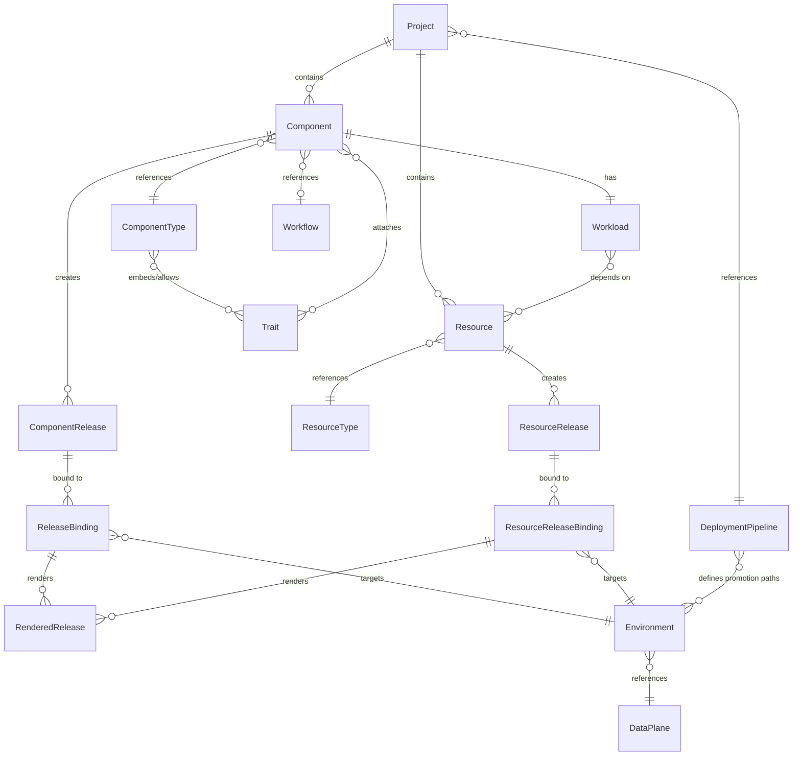

# OpenChoreo Resource Kinds

This document describes the resource kinds used in OpenChoreo CRDs, the relationships between them, and detailed information about each kind.

## Overview

- [Design Considerations](#design-considerations)
- [Resource Hierarchy](#resource-hierarchy)
- [Kubernetes Metadata Representation](#kubernetes-metadata-representation)
- [Resource Kinds](#resource-kinds)
  - [Developer Abstractions](#developer-abstractions)
    - [Project](#project)
    - [Component](#component)
    - [Workload](#workload)
    - [ComponentRelease](#componentrelease)
    - [ReleaseBinding](#releasebinding)
    - [RenderedRelease](#renderedrelease)
    - [Resource](#resource)
    - [ResourceRelease](#resourcerelease)
    - [ResourceReleaseBinding](#resourcereleasebinding)
  - [Composition and Templating](#composition-and-templating)
    - [ComponentType / ClusterComponentType](#componenttype--clustercomponenttype)
    - [Trait / ClusterTrait](#trait--clustertrait)
    - [ResourceType / ClusterResourceType](#resourcetype--clusterresourcetype)
    - [Workflow / ClusterWorkflow](#workflow--clusterworkflow)
    - [WorkflowRun](#workflowrun)
  - [Platform Infrastructure](#platform-infrastructure)
    - [DeploymentPipeline](#deploymentpipeline)
    - [Environment](#environment)
    - [DataPlane / ClusterDataPlane](#dataplane--clusterdataplane)
    - [WorkflowPlane / ClusterWorkflowPlane](#workflowplane--clusterworkflowplane)
    - [ObservabilityPlane / ClusterObservabilityPlane](#observabilityplane--clusterobservabilityplane)
  - [External Configuration](#external-configuration)
    - [SecretReference](#secretreference)
  - [Authorization](#authorization)
    - [AuthzRole / ClusterAuthzRole](#authzrole--clusterauthzrole)
    - [AuthzRoleBinding / ClusterAuthzRoleBinding](#authzrolebinding--clusterauthzrolebinding)
  - [Observability Alerts](#observability-alerts)
    - [ObservabilityAlertRule](#observabilityalertrule)
    - [ObservabilityAlertsNotificationChannel](#observabilityalertsnotificationchannel)

## Design Considerations

When designing the resource kinds for OpenChoreo, several principles have been followed to ensure consistency between resource kinds. These considerations help to keep a clear mapping of OpenChoreo concepts to resource kinds while maintaining simplicity.

- Each concept in OpenChoreo has a corresponding resource kind. This one-to-one mapping ensures that users can easily understand the resource model.
- In situations where a resource kind is required but does not directly correspond to a core concept:
  - If two resource kinds share a one-to-one relationship, they are combined into a single resource kind.
  - If combining them introduces implementation complexity or if it makes logical sense to keep them distinct, they remain separate.
- **Scope pairing**: Most resources have namespace-scoped and cluster-scoped variants (e.g., `ComponentType` / `ClusterComponentType`). Cluster-scoped types can only reference other cluster-scoped types.
- **Immutability**: Key fields use `XValidation:rule="self == oldSelf"` to enforce immutability after creation (e.g., ComponentRelease spec, Component owner).
- **CEL templating**: Resource templates, trait creates/patches, and workflow templates use `${...}` syntax for CEL expressions.

[Back to Top](#overview)

## Resource Hierarchy

The following diagram shows the relationships between the core resource kinds in OpenChoreo.



### Core Deployment Flow

```
Project (defines deployment pipeline)
  └── Component (references ComponentType, attaches Traits, configures Workflow)
       ├── Workload (container spec, endpoints, dependencies on endpoints + resources)
       └── ComponentRelease (immutable snapshot of ComponentType + Traits + Workload)
            └── ReleaseBinding (binds release to Environment with overrides)
                 └── RenderedRelease (final K8s manifests → applied to DataPlane)
```

### Managed-Infrastructure Flow

```
Project
  └── Resource (references ResourceType, supplies parameters)
       └── ResourceRelease (immutable snapshot of Resource.spec + ResourceType.spec)
            └── ResourceReleaseBinding (pins release to Environment with overrides)
                 └── RenderedRelease (provisioned K8s manifests → applied to DataPlane)
```

Workloads consume Resources via `Workload.spec.dependencies.resources[]`; the ReleaseBinding render waits for each
referenced ResourceReleaseBinding to be Ready before producing its RenderedRelease.

### Platform Infrastructure

```
DeploymentPipeline (defines promotion paths between Environments)
Environment (runtime context: dev/staging/prod, references DataPlane)
DataPlane / ClusterDataPlane (target K8s cluster, agent-based connectivity)
WorkflowPlane / ClusterWorkflowPlane (Argo-based CI/CD execution)
ObservabilityPlane / ClusterObservabilityPlane (OpenSearch-based monitoring)
```

[Back to Top](#overview)

## Kubernetes Metadata Representation

OpenChoreo resources use standard Kubernetes metadata conventions:

| Field | Description |
|-------|-------------|
| `metadata.name` | Unique name within scope (namespace or cluster) |
| `metadata.namespace` | Namespace for namespace-scoped resources |
| `metadata.labels` | Kubernetes labels for selection and filtering |
| `metadata.annotations` | Additional metadata |

Resources are organized under Kubernetes namespaces which serve as organizational boundaries (similar to organizations/tenants). Projects, Components, and their related resources all live within a namespace.

[Back to Top](#overview)

## Resource Kinds

### Developer Abstractions

---

#### Project

| | |
|---|---|
| **Scope** | Namespaced |
| **Purpose** | Logical grouping of related components and definition of deployment progression |

**Spec:**

| Field | Type | Required | Description |
|-------|------|----------|-------------|
| `deploymentPipelineRef` | DeploymentPipelineRef | Yes | References the DeploymentPipeline that defines environments and promotion paths |

**Status:**

| Field | Type | Description |
|-------|------|-------------|
| `observedGeneration` | int64 | Last observed generation |
| `conditions` | []Condition | Standard Kubernetes conditions |

**Relationships:**
- References: DeploymentPipeline
- Owns: Components, ReleaseBindings

[Back to Top](#overview)

---

#### Component

| | |
|---|---|
| **Scope** | Namespaced |
| **Short Names** | `comp`, `comps` |
| **Purpose** | Developer's deployable unit — the primary resource developers interact with |

**Spec:**

| Field | Type | Required | Mutable | Description |
|-------|------|----------|---------|-------------|
| `owner.projectName` | string | Yes | No | Parent Project name |
| `componentType` | ComponentTypeRef | Yes | No | References ComponentType in format `{workloadType}/{name}` |
| `autoDeploy` | bool | No | Yes | Auto-create ComponentRelease and ReleaseBinding on changes |
| `autoBuild` | bool | No | Yes | Trigger builds on code push (requires webhooks) |
| `parameters` | RawExtension | No | Yes | Developer-provided values matching ComponentType schema |
| `traits[]` | ComponentTrait[] | No | Yes | Additional trait instances (instanceName, kind, name, parameters) |
| `workflow` | ComponentWorkflowConfig | No | Yes | Build workflow reference (kind, name, parameters) |

**Status:**

| Field | Type | Description |
|-------|------|-------------|
| `observedGeneration` | int64 | Last observed generation |
| `conditions` | []Condition | Standard Kubernetes conditions |
| `latestRelease` | LatestRelease | Name and hash of the latest ComponentRelease |

**Relationships:**
- Owner: Project (via `spec.owner.projectName`)
- References: ComponentType or ClusterComponentType, Trait/ClusterTrait, Workflow/ClusterWorkflow
- Creates: ComponentRelease (when `autoDeploy=true`)
- Has: Workload (one-to-one, same namespace)

[Back to Top](#overview)

---

#### Workload

| | |
|---|---|
| **Scope** | Namespaced |
| **Purpose** | Container specification, endpoints, connections, and source configuration for a component |

**Spec:**

| Field | Type | Required | Description |
|-------|------|----------|-------------|
| `owner.projectName` | string | Yes | Parent Project (immutable) |
| `owner.componentName` | string | Yes | Parent Component (immutable) |
| `container.image` | string | Yes | OCI container image |
| `container.command` | []string | No | Container entrypoint |
| `container.args` | []string | No | Container arguments |
| `container.env[]` | EnvVar[] | No | Environment variables (key/value or secretKeyRef) |
| `container.files[]` | FileVar[] | No | Mounted files (key/mountPath/value or secretKeyRef) |
| `endpoints` | map[string]WorkloadEndpoint | No | Named endpoints with type, port, visibility, basePath |
| `dependencies.endpoints[]` | WorkloadConnection[] | No | Dependencies on other components' endpoints |
| `dependencies.resources[]` | WorkloadResourceDependency[] | No | Dependencies on project-bound Resources (ref + envBindings + fileBindings) |

**Endpoint Fields:**

| Field | Type | Required | Description |
|-------|------|----------|-------------|
| `type` | EndpointType | Yes | HTTP, gRPC, GraphQL, Websocket, TCP, UDP |
| `port` | int32 | Yes | Exposed port |
| `targetPort` | int32 | No | Container listening port (defaults to port) |
| `visibility` | []EndpointVisibility | No | project, namespace, internal, external |
| `basePath` | string | No | URL base path |
| `schema` | EndpointSchema | No | API schema (type + content) |

**Relationships:**
- Owner: Component (via `spec.owner.componentName`)
- References: Resource (via `dependencies.resources[].ref`)
- Referenced by: ComponentRelease (snapshot copy)

[Back to Top](#overview)

---

#### ComponentRelease

| | |
|---|---|
| **Scope** | Namespaced |
| **Purpose** | Immutable snapshot created when a component is released, capturing frozen specs |

All spec fields are **immutable** after creation (enforced via `XValidation:rule="self == oldSelf"`).

**Spec:**

| Field | Type | Required | Description |
|-------|------|----------|-------------|
| `owner.projectName` | string | Yes | Parent Project |
| `owner.componentName` | string | Yes | Parent Component |
| `componentType` | ComponentReleaseComponentType | Yes | Frozen ComponentType kind, name, and full spec |
| `traits[]` | ComponentReleaseTrait[] | No | Frozen Trait kind, name, and full spec |
| `componentProfile` | ComponentProfile | No | Frozen parameters and trait configurations |
| `workload` | WorkloadTemplateSpec | Yes | Frozen workload (container, endpoints) |

**Relationships:**
- Owner: Component
- Referenced by: ReleaseBinding (via `spec.releaseName`)
- Contains frozen copies of: ComponentType spec, Trait specs, Workload spec

[Back to Top](#overview)

---

#### ReleaseBinding

| | |
|---|---|
| **Scope** | Namespaced |
| **Purpose** | Binds a ComponentRelease to an Environment with environment-specific overrides |

**Spec:**

| Field | Type | Required | Mutable | Description |
|-------|------|----------|---------|-------------|
| `owner.projectName` | string | Yes | No | Parent Project |
| `owner.componentName` | string | Yes | No | Parent Component |
| `environment` | string | Yes | No | Target environment name |
| `releaseName` | string | No | Yes | ComponentRelease to deploy |
| `componentTypeEnvironmentConfigs` | RawExtension | No | Yes | Per-environment ComponentType overrides |
| `traitEnvironmentConfigs` | map[string]RawExtension | No | Yes | Per-environment trait overrides (keyed by instanceName) |
| `workloadOverrides` | WorkloadOverrideTemplateSpec | No | Yes | Container env/file overrides |
| `state` | ReleaseState | No | Yes | Active (default) or Undeploy |

**Status:**

| Field | Type | Description |
|-------|------|-------------|
| `observedGeneration` | int64 | Last observed generation |
| `conditions` | []Condition | Standard Kubernetes conditions |
| `endpoints[]` | EndpointURLStatus[] | Resolved invoke URLs (service URL, gateway URLs) |
| `resolvedConnections[]` | ResolvedConnection[] | Successfully resolved inter-component connections |
| `pendingConnections[]` | PendingConnection[] | Connections awaiting resolution |
| `secretReferenceNames[]` | []string | SecretReferences used by workload |

**Relationships:**
- Owner: Project (via `spec.owner.projectName`)
- References: ComponentRelease, Environment
- Creates: RenderedRelease (rendered K8s manifests)

[Back to Top](#overview)

---

#### RenderedRelease

| | |
|---|---|
| **Scope** | Namespaced |
| **Purpose** | Final rendered K8s manifests deployed to a data plane or observability plane |

**Spec:**

| Field | Type | Required | Description |
|-------|------|----------|-------------|
| `owner.projectName` | string | Yes | Parent Project |
| `owner.componentName` | string | Yes | Parent Component |
| `environmentName` | string | Yes | Target environment |
| `resources[]` | Resource[] | No | Rendered K8s resources (id + raw object) |
| `targetPlane` | string | No | `dataplane` (default) or `observabilityplane` |
| `interval` | Duration | No | Stable-state watch interval (default 5m) |
| `progressingInterval` | Duration | No | Transitioning watch interval (default 10s) |

**Status:**

| Field | Type | Description |
|-------|------|-------------|
| `conditions` | []Condition | Standard Kubernetes conditions |
| `resources[]` | ResourceStatus[] | Per-resource status with health tracking |

**Resource Health States:** Unknown, Progressing, Healthy, Suspended, Degraded

**Relationships:**
- Created by: ReleaseBinding controller
- Deployed to: DataPlane or ObservabilityPlane

For detailed design documentation, see [RenderedRelease CRD Design](crds/renderedrelease.md).

[Back to Top](#overview)

---

#### Resource

| | |
|---|---|
| **Scope** | Namespaced |
| **Short Names** | `res` |
| **Purpose** | Developer-declared dependency on managed infrastructure provisioned through a ResourceType |

**Spec:**

| Field | Type | Required | Mutable | Description |
|-------|------|----------|---------|-------------|
| `owner.projectName` | string | Yes | No | Parent Project name (immutable) |
| `type` | ResourceTypeRef | Yes | No | References ResourceType (`kind` + `name`); `kind` defaults to `ResourceType` (immutable) |
| `parameters` | RawExtension | No | Yes | Developer-provided values matching the referenced ResourceType's parameters schema |

**Status:**

| Field | Type | Description |
|-------|------|-------------|
| `observedGeneration` | int64 | Last observed generation |
| `conditions` | []Condition | Standard Kubernetes conditions |
| `latestRelease` | LatestResourceRelease | Name and hash of the latest ResourceRelease cut from this Resource |

**Relationships:**
- Owner: Project (via `spec.owner.projectName`)
- References: ResourceType or ClusterResourceType
- Creates: ResourceRelease (when spec or referenced ResourceType spec changes)
- Consumed by: Workload (via `dependencies.resources[].ref`)

[Back to Top](#overview)

---

#### ResourceRelease

| | |
|---|---|
| **Scope** | Namespaced |
| **Purpose** | Immutable snapshot of a Resource and its referenced (Cluster)ResourceType at release time |

All spec fields are **immutable** after creation (enforced via `XValidation:rule="self == oldSelf"`).

**Spec:**

| Field | Type | Required | Description |
|-------|------|----------|-------------|
| `owner.projectName` | string | Yes | Parent Project |
| `owner.resourceName` | string | Yes | Parent Resource |
| `resourceType.kind` | string | Yes | `ResourceType` or `ClusterResourceType` (source kind at snapshot time) |
| `resourceType.name` | string | Yes | Name of the source (Cluster)ResourceType |
| `resourceType.spec` | ResourceTypeSpec | Yes | Frozen spec of the (Cluster)ResourceType at release time |
| `parameters` | RawExtension | No | Frozen `Resource.spec.parameters` at release time |

**Naming:** ResourceReleases are named `{resource}-{hash}`, where the hash covers `Resource.spec` + `(Cluster)ResourceType.spec` at the moment the release was cut.

**Relationships:**
- Owner: Resource (deletion is cascaded by the Resource finalizer, second phase)
- Referenced by: ResourceReleaseBinding (via `spec.resourceRelease`)
- Contains frozen copies of: (Cluster)ResourceType spec, Resource parameters

[Back to Top](#overview)

---

#### ResourceReleaseBinding

| | |
|---|---|
| **Scope** | Namespaced |
| **Short Names** | `rrb`, `rrbs` |
| **Purpose** | Binds a ResourceRelease to an Environment with environment-specific overrides and retention policy |

**Spec:**

| Field | Type | Required | Mutable | Description |
|-------|------|----------|---------|-------------|
| `owner.projectName` | string | Yes | No | Parent Project |
| `owner.resourceName` | string | Yes | No | Parent Resource |
| `environment` | string | Yes | No | Target environment name (immutable) |
| `resourceRelease` | string | No | Yes | ResourceRelease name to pin. Advanced manually via `occ resource promote` or kubectl edit |
| `retainPolicy` | ResourceRetainPolicy | No | Yes | `Delete` or `Retain`. Per-env override; falls back to the (Cluster)ResourceType's `retainPolicy` (default `Delete`) |
| `resourceTypeEnvironmentConfigs` | RawExtension | No | Yes | Per-environment values validated against `(Cluster)ResourceType.spec.environmentConfigs` |

**Status:**

| Field | Type | Description |
|-------|------|-------------|
| `conditions` | []Condition | Standard Kubernetes conditions: `Synced`, `ResourcesReady`, `OutputsResolved`, `Ready`, `Finalizing` |
| `outputs[]` | ResolvedResourceOutput[] | Resolved output values per declared output (value / secretKeyRef / configMapKeyRef) |

**Relationships:**
- Owner: Resource (via `spec.owner.resourceName`); Resource finalizer's first phase blocks Resource deletion while any binding still references it
- References: ResourceRelease, Environment
- Creates: RenderedRelease (rendered K8s manifests applied to the target DataPlane)

**Retention:** `retainPolicy: Retain` holds the binding's finalizer on deletion. The binding stays in `Terminating` with `Finalizing` reason `RetainHold` and the data-plane state persists until the policy is flipped back to `Delete`.

**Authoring:** ResourceReleaseBindings are authored by platform engineers or GitOps tooling. The Resource controller never fans them out automatically.

[Back to Top](#overview)

---

### Composition and Templating

---

#### ComponentType / ClusterComponentType

| | |
|---|---|
| **Scope** | Namespaced (`ComponentType`) / Cluster (`ClusterComponentType`) |
| **Short Names** | `ct`, `cts` |
| **Purpose** | Platform engineer's template defining what a component looks like and what resources it creates |

**Spec:**

| Field | Type | Required | Description |
|-------|------|----------|-------------|
| `workloadType` | string | Yes | Immutable. One of: deployment, statefulset, cronjob, job, proxy |
| `parameters` | SchemaSection | No | Developer-configurable fields (ocSchema or openAPIV3Schema) |
| `environmentConfigs` | SchemaSection | No | Per-environment override schema |
| `traits[]` | ComponentTypeTrait[] | No | Pre-configured embedded traits with parameter/environmentConfig bindings |
| `allowedTraits[]` | TraitRef[] | No | Additional traits developers can attach |
| `allowedWorkflows[]` | WorkflowRef[] | No | Permitted build workflows |
| `validations[]` | ValidationRule[] | No | CEL validation rules |
| `resources[]` | ResourceTemplate[] | Yes (min 1) | K8s resource templates with CEL expressions |

**ResourceTemplate Fields:**

| Field | Type | Required | Description |
|-------|------|----------|-------------|
| `id` | string | Yes | Resource identifier (must match workloadType for primary resource) |
| `targetPlane` | string | No | `dataplane` (default) or `observabilityplane` |
| `includeWhen` | string | No | CEL expression — conditionally include resource |
| `forEach` | string | No | CEL expression — iterate to create multiple resources |
| `var` | string | No | Loop variable name |
| `template` | RawExtension | Yes | K8s resource with `${...}` CEL template expressions |

**SchemaSection** supports two mutually exclusive formats:
- `ocSchema` — OpenChoreo shorthand format (e.g., `replicas: "integer | default=1"`)
- `openAPIV3Schema` — Standard OpenAPI v3 JSON Schema

**Cluster-scoped variant** (`ClusterComponentType`) only references `ClusterTrait` and `ClusterWorkflow`.

[Back to Top](#overview)

---

#### Trait / ClusterTrait

| | |
|---|---|
| **Scope** | Namespaced (`Trait`) / Cluster (`ClusterTrait`) |
| **Purpose** | Composable behavior that can be added to components — creates new resources or patches existing ones |

**Spec:**

| Field | Type | Required | Description |
|-------|------|----------|-------------|
| `parameters` | SchemaSection | No | Developer-facing configuration schema |
| `environmentConfigs` | SchemaSection | No | Per-environment override schema |
| `validations[]` | ValidationRule[] | No | CEL validation rules |
| `creates[]` | TraitCreate[] | No | New K8s resources to create |
| `patches[]` | TraitPatch[] | No | JSONPatch modifications to existing resources |

**TraitCreate** has the same structure as ResourceTemplate (id, targetPlane, includeWhen, forEach, var, template).

**TraitPatch Fields:**

| Field | Type | Required | Description |
|-------|------|----------|-------------|
| `target` | PatchTarget | Yes | Target resource by group/version/kind, optional `where` CEL filter |
| `targetPlane` | string | No | `dataplane` (default) or `observabilityplane` |
| `forEach` | string | No | CEL expression for iteration |
| `operations[]` | JSONPatchOperation[] | Yes (min 1) | JSONPatch operations (op: add/replace/remove, path, value) |

[Back to Top](#overview)

---

#### ResourceType / ClusterResourceType

| | |
|---|---|
| **Scope** | Namespaced (`ResourceType`) / Cluster (`ClusterResourceType`) |
| **Short Names** | `rt`, `rts` / `crt`, `crts` |
| **Purpose** | Platform engineer's template for provisioning managed infrastructure (databases, queues, caches) and declaring the outputs consumers wire into containers |

**Spec:**

| Field | Type | Required | Description |
|-------|------|----------|-------------|
| `parameters` | SchemaSection | No | Schema for `Resource.spec.parameters` values (validated by the Resource controller) |
| `environmentConfigs` | SchemaSection | No | Schema for `ResourceReleaseBinding.spec.resourceTypeEnvironmentConfigs` per-env overrides |
| `retainPolicy` | ResourceRetainPolicy | No | Default deletion behavior for bindings of this type: `Delete` (default) or `Retain` |
| `outputs[]` | ResourceTypeOutput[] | No | Named outputs consumers bind to via `Workload.spec.dependencies.resources[]` |
| `resources[]` | ResourceTypeManifest[] | Yes (min 1) | K8s manifest templates the provisioner emits on the data plane |

**ResourceTypeOutput Fields:** Each output picks exactly one of `value`, `secretKeyRef`, or `configMapKeyRef`.

| Field | Type | Required | Description |
|-------|------|----------|-------------|
| `name` | string | Yes | Unique output identifier (referenced by consumer `envBindings` / `fileBindings` keys) |
| `value` | string | No | Literal or `${...}` CEL expression. The resolved value transits to the control plane |
| `secretKeyRef.name` | string | Yes (when set) | Data-plane Secret name (CEL-templated). Only `{name, key}` transits to the control plane |
| `secretKeyRef.key` | string | Yes (when set) | Key within the Secret (CEL-templated) |
| `configMapKeyRef.name` | string | Yes (when set) | Data-plane ConfigMap name (CEL-templated) |
| `configMapKeyRef.key` | string | Yes (when set) | Key within the ConfigMap (CEL-templated) |

**ResourceTypeManifest Fields:**

| Field | Type | Required | Description |
|-------|------|----------|-------------|
| `id` | string | Yes | Unique identifier within the ResourceType (referenced by `readyWhen` / `outputs` via `applied.<id>.*`) |
| `includeWhen` | string | No | `${...}`-wrapped CEL boolean; when false, the entry is omitted from the render and any prior object is GC'd |
| `template` | RawExtension | Yes | K8s resource template with `${...}` CEL expressions |
| `readyWhen` | string | No | `${...}`-wrapped CEL boolean evaluated after the manifest has been applied; gates `ResourceReleaseBinding.status.conditions[ResourcesReady]`. Falls back to per-Kind health heuristic when unset |

**CEL Surface:** Templates have access to `metadata.*`, `parameters.*`, `environmentConfigs.*`, `dataplane.*`, and `gateway.*`. `outputs[]` and `readyWhen` additionally see `applied.<id>.status.*` once the manifest has been applied. `includeWhen` is evaluated at render time and does **not** see `applied.<id>.*`.

**Cluster-scoped variant** (`ClusterResourceType`) shares the same spec shape. Example ClusterResourceTypes (`postgres`, `valkey`, `nats`) ship under `samples/getting-started/cluster-resource-types/` to demonstrate the pattern; these use in-cluster StatefulSets and are intended for local development, not production use.

[Back to Top](#overview)

---

#### Workflow / ClusterWorkflow

| | |
|---|---|
| **Scope** | Namespaced (`Workflow`) / Cluster (`ClusterWorkflow`) |
| **Purpose** | Build workflow template defining how source code is built into container images |

**Spec:**

| Field | Type | Required | Description |
|-------|------|----------|-------------|
| `workflowPlaneRef` | WorkflowPlaneRef | No | Target WorkflowPlane (default: ClusterWorkflowPlane/default) |
| `parameters` | SchemaSection | No | Developer-configurable build parameters |
| `runTemplate` | RawExtension | Yes | K8s resource template (typically Argo WorkflowTemplate) |
| `resources[]` | WorkflowResource[] | No | Additional resources deployed alongside (secrets, configmaps) |
| `externalRefs[]` | ExternalRef[] | No | External CR references resolved at runtime |
| `ttlAfterCompletion` | string | No | TTL for cleanup (e.g., `90d`, `1h30m`) |

**Cluster-scoped variant** (`ClusterWorkflow`) only references `ClusterWorkflowPlane`.

[Back to Top](#overview)

---

#### WorkflowRun

| | |
|---|---|
| **Scope** | Namespaced |
| **Purpose** | Runtime execution instance of a Workflow |

**Spec:**

| Field | Type | Required | Description |
|-------|------|----------|-------------|
| `workflow.kind` | string | Yes | WorkflowRefKind (immutable, default: ClusterWorkflow) |
| `workflow.name` | string | Yes | Workflow/ClusterWorkflow name (immutable) |
| `workflow.parameters` | RawExtension | No | Developer-provided build parameter values |
| `ttlAfterCompletion` | string | No | Copied from Workflow template |

**Status:**

| Field | Type | Description |
|-------|------|-------------|
| `conditions` | []Condition | Standard Kubernetes conditions |
| `runReference` | ResourceReference | Actual workflow execution reference in the workflow plane cluster |
| `resources[]` | ResourceReference[] | Additional resources applied |
| `tasks[]` | WorkflowTask[] | Vendor-neutral task view (name, phase, timing, message) |
| `startedAt` | Time | Execution start time |
| `completedAt` | Time | Execution completion time |

**Task Phases:** Pending, Running, Succeeded, Failed, Skipped, Error

[Back to Top](#overview)

---

### Platform Infrastructure

---

#### DeploymentPipeline

| | |
|---|---|
| **Scope** | Namespaced |
| **Purpose** | Defines promotion paths between environments |

**Spec:**

| Field | Type | Required | Description |
|-------|------|----------|-------------|
| `promotionPaths[]` | PromotionPath[] | No | List of source → target environment promotion paths |
| `promotionPaths[].sourceEnvironmentRef` | EnvironmentRef | Yes | Source environment |
| `promotionPaths[].targetEnvironmentRefs[]` | TargetEnvironmentRef[] | Yes | Destination environments |

**Relationships:**
- Referenced by: Project
- References: Environment

[Back to Top](#overview)

---

#### Environment

| | |
|---|---|
| **Scope** | Namespaced |
| **Purpose** | Runtime context (dev, staging, prod) for component deployment |

**Spec:**

| Field | Type | Required | Description |
|-------|------|----------|-------------|
| `dataPlaneRef` | DataPlaneRef | No | Target DataPlane (default: DataPlane/default). Immutable once set. |
| `isProduction` | bool | No | Marks environment as production |
| `gateway` | GatewaySpec | No | Environment-specific gateway configuration (overrides DataPlane gateway) |

**Gateway Configuration:**

```yaml
gateway:
  ingress:
    external:
      name: "gateway-name"
      namespace: "gateway-namespace"
      http:
        listenerName: "http"
        port: 8080
        host: "app.example.com"
      https:
        listenerName: "https"
        port: 8443
        host: "app.example.com"
    internal:
      # Same structure as external
  egress:
    # Same structure as ingress
```

**Relationships:**
- Referenced by: ReleaseBinding, DeploymentPipeline
- References: DataPlane or ClusterDataPlane

[Back to Top](#overview)

---

#### DataPlane / ClusterDataPlane

| | |
|---|---|
| **Scope** | Namespaced (`DataPlane`) / Cluster (`ClusterDataPlane`) |
| **Purpose** | Target Kubernetes cluster for workload deployment, connected via cluster agent |

**Spec:**

| Field | Type | Required | Description |
|-------|------|----------|-------------|
| `planeID` | string | No* | Logical plane identifier (*required for ClusterDataPlane) |
| `clusterAgent` | ClusterAgentConfig | Yes | WebSocket connection config with client CA |
| `gateway` | GatewaySpec | No | API gateway configuration |
| `secretStoreRef` | SecretStoreRef | No | ESO ClusterSecretStore reference |
| `observabilityPlaneRef` | ObservabilityPlaneRef | No | Associated observability plane |

**Status:**

| Field | Type | Description |
|-------|------|-------------|
| `conditions` | []Condition | Standard Kubernetes conditions |
| `agentConnection` | AgentConnectionStatus | Connection state (connected, agent count, heartbeat times) |

**Cluster-scoped variant** (`ClusterDataPlane`) only references `ClusterObservabilityPlane`.

[Back to Top](#overview)

---

#### WorkflowPlane / ClusterWorkflowPlane

| | |
|---|---|
| **Scope** | Namespaced (`WorkflowPlane`) / Cluster (`ClusterWorkflowPlane`) |
| **Purpose** | Argo-based CI/CD execution environment |

**Spec:**

| Field | Type | Required | Description |
|-------|------|----------|-------------|
| `planeID` | string | No* | Logical plane identifier (*required for cluster-scoped) |
| `clusterAgent` | ClusterAgentConfig | Yes | WebSocket connection config |
| `secretStoreRef` | SecretStoreRef | No | ESO ClusterSecretStore reference |
| `observabilityPlaneRef` | ObservabilityPlaneRef | No | Associated observability plane |

**Status:** Same as DataPlane (conditions + agentConnection).

[Back to Top](#overview)

---

#### ObservabilityPlane / ClusterObservabilityPlane

| | |
|---|---|
| **Scope** | Namespaced (`ObservabilityPlane`) / Cluster (`ClusterObservabilityPlane`) |
| **Purpose** | OpenSearch-based monitoring and observability |

**Spec:**

| Field | Type | Required | Description |
|-------|------|----------|-------------|
| `planeID` | string | No* | Logical plane identifier (*required for cluster-scoped) |
| `clusterAgent` | ClusterAgentConfig | Yes | WebSocket connection config |
| `observerURL` | string | Yes | Base URL of the Observer API |
| `rcaAgentURL` | string | No | RCA Agent API URL |
| `finOpsAgentURL` | string | No | FinOps Agent API URL |

**Status:** Same as DataPlane (conditions + agentConnection).

[Back to Top](#overview)

---

### External Configuration

---

#### SecretReference

| | |
|---|---|
| **Scope** | Namespaced |
| **Purpose** | Maps external secrets to Kubernetes Secrets via External Secrets Operator |

**Spec:**

| Field | Type | Required | Description |
|-------|------|----------|-------------|
| `template` | SecretTemplate | Yes | Secret type and metadata (annotations, labels) |
| `data[]` | SecretDataSource[] | Yes (min 1) | Mapping of secret keys to external store references |
| `refreshInterval` | Duration | No | Refresh interval (default: 1h) |

**SecretDataSource Fields:**

| Field | Type | Required | Description |
|-------|------|----------|-------------|
| `secretKey` | string | Yes | Kubernetes secret key name |
| `remoteRef.key` | string | Yes | Path in external secret store |
| `remoteRef.property` | string | No | Specific field within the secret |
| `remoteRef.version` | string | No | Version identifier |

**Status:**

| Field | Type | Description |
|-------|------|-------------|
| `conditions` | []Condition | Standard Kubernetes conditions |
| `lastRefreshTime` | Time | Last successful refresh |
| `secretStores[]` | SecretStoreReference[] | Associated secret stores |

[Back to Top](#overview)

---

### Authorization

---

#### AuthzRole / ClusterAuthzRole

| | |
|---|---|
| **Scope** | Namespaced (`AuthzRole`) / Cluster (`ClusterAuthzRole`) |
| **Purpose** | Defines a set of permitted actions |

**Spec:**

| Field | Type | Required | Description |
|-------|------|----------|-------------|
| `actions[]` | []string | Yes (min 1) | Allowed actions (e.g., `component:create`, `component:delete`) |
| `description` | string | No | Human-readable description |

[Back to Top](#overview)

---

#### AuthzRoleBinding / ClusterAuthzRoleBinding

| | |
|---|---|
| **Scope** | Namespaced (`AuthzRoleBinding`) / Cluster (`ClusterAuthzRoleBinding`) |
| **Purpose** | Grants roles to JWT-authenticated subjects |

**Spec:**

| Field | Type | Required | Description |
|-------|------|----------|-------------|
| `entitlement` | EntitlementClaim | Yes | JWT claim/value pair identifying the subject |
| `roleMappings[]` | RoleMapping[] | Yes (min 1) | Role references with optional scope |
| `effect` | EffectType | No | `allow` (default) or `deny` |

**RoleMapping Fields:**

| Field | Type | Required | Description |
|-------|------|----------|-------------|
| `roleRef` | RoleRef | Yes | References AuthzRole or ClusterAuthzRole (kind + name) |
| `scope` | TargetScope | No | Optional narrowing to project and/or component |

**Scope Constraints:**
- Namespace-scoped: `scope` can specify `project` and optionally `component` (component requires project)
- Cluster-scoped: `scope` can additionally specify `namespace` (project requires namespace, component requires project)

[Back to Top](#overview)

---

### Observability Alerts

---

#### ObservabilityAlertRule

| | |
|---|---|
| **Scope** | Namespaced |
| **Purpose** | Defines alert rules based on log or metric telemetry data |

**Spec:**

| Field | Type | Required | Description |
|-------|------|----------|-------------|
| `source` | ObservabilityAlertSource | Yes | Telemetry source (type: log or metric, query, timeWindow) |
| `condition` | ObservabilityAlertCondition | Yes | Trigger condition (operator: gt/lt/gte/lte/eq, threshold) |
| `severity` | ObservabilityAlertSeverity | Yes | info, warning, or critical |
| `notificationChannelRef` | NotificationChannelRef | No | Reference to notification channel |

---

#### ObservabilityAlertsNotificationChannel

| | |
|---|---|
| **Scope** | Namespaced |
| **Purpose** | Defines notification channels (email, webhook) for alert delivery |

**Spec:**

| Field | Type | Required | Description |
|-------|------|----------|-------------|
| `type` | NotificationChannelType | Yes | `email` or `webhook` |
| `email` | EmailConfig | Conditional | Email configuration (from, to, SMTP, template) — required when type=email |
| `webhook` | WebhookConfig | Conditional | Webhook configuration (URL, headers, template) — required when type=webhook |

[Back to Top](#overview)

---

## Common Reference Types

OpenChoreo uses typed reference types to link resources together. Each reference type includes a `kind` field that determines whether the target is namespace-scoped or cluster-scoped.

| Reference Type | Kind Values | Default Kind |
|----------------|-------------|--------------|
| `ComponentTypeRef` | ComponentType, ClusterComponentType | ComponentType |
| `TraitRef` | Trait, ClusterTrait | Trait |
| `ResourceTypeRef` | ResourceType, ClusterResourceType | ResourceType |
| `WorkflowRef` | Workflow, ClusterWorkflow | ClusterWorkflow |
| `DataPlaneRef` | DataPlane, ClusterDataPlane | DataPlane |
| `WorkflowPlaneRef` | WorkflowPlane, ClusterWorkflowPlane | ClusterWorkflowPlane |
| `ObservabilityPlaneRef` | ObservabilityPlane, ClusterObservabilityPlane | ObservabilityPlane |
| `RoleRef` | AuthzRole, ClusterAuthzRole | AuthzRole |
| `DeploymentPipelineRef` | DeploymentPipeline | DeploymentPipeline |
| `EnvironmentRef` | Environment | Environment |

ComponentTypeRef uses a special name format: `{workloadType}/{componentTypeName}` (e.g., `deployment/my-service-type`).

[Back to Top](#overview)
