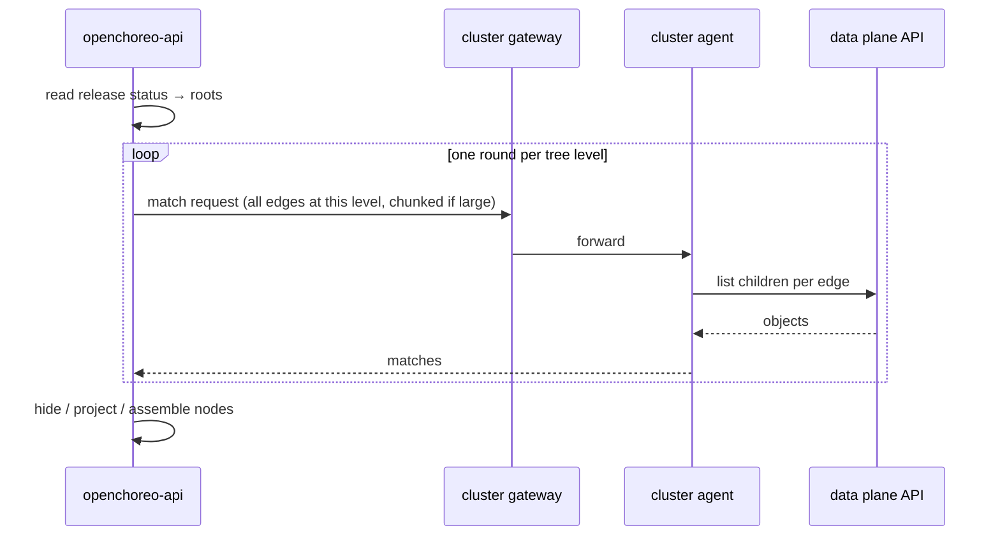

# Child resource discovery

The release resource tree shows the resources a release created *and* the
resources Kubernetes created underneath them: the ReplicaSet under a
Deployment, the Pods under that ReplicaSet. Which parent-to-child hops it walks
is configuration, not code: the `resource_tree` section of the openchoreo-api
config declares them as **traversal rules**.

That means you can make the tree follow kinds this build of OpenChoreo has never
heard of. If your platform runs a CRD whose controller creates Deployments, add
a rule and those Deployments appear under it, along with their Pods.

This page is the rule-authoring reference: the schema, the two matchers, how to
grant the cluster agent permission to read the kinds you named, and the
behaviors that will otherwise surprise you.

## How a tree gets built

Take one request for a release with one Deployment named `checkout`. The walk
has four stages:

1. **Roots.** openchoreo-api reads the release's own status. The status lists
   the resources the release rendered, and `apps/v1 Deployment checkout` is one
   of them. These are the roots; nothing below them is recorded in the release.
2. **Match.** For each root, openchoreo-api looks up the rule keyed by that
   root's group and kind and turns every child edge in it into a match query.
   Roots sharing an edge share a query, so two Deployments' ReplicaSets are
   asked for together. It batches the level's queries, across all roots, into
   one request, or a few when the level holds more queries or more parents per
   query than one request may carry.
3. **Expand.** The request crosses the cluster gateway to the target plane's
   cluster agent. The agent runs it against the *data plane's* API server and
   returns the matching children. openchoreo-api then repeats stages 2 and 3 for
   the children it just received, one level at a time.
4. **Render.** Matched objects become tree nodes. Nodes marked `hide` are walked
   through but not emitted; nodes marked `metadata_only` are emitted with their
   spec, status and data stripped.



The matching happens in the data plane, next to the objects. The control plane
does not list the data plane's resources itself, with one exception: when the
agent or the gateway is too old to serve the match call, openchoreo-api falls
back to proxying list calls through the gateway. See [Operating
notes](#operating-notes).

## Where rules live

openchoreo-api reads rules from its config file, under `resource_tree`:

```yaml
resource_tree:
  rules:
    - root: {group: apps, version: v1, kind: Deployment, resource: deployments}
      children:
        - kind: {version: v1, kind: Pod, resource: pods}
```

You do not normally edit that file. In a Helm install the chart's ConfigMap
mounts over it. Two sources feed the list, and a third value switches one of
them off:

| Source | What it holds |
| --- | --- |
| `files/resource-tree-builtin-rules.yaml` in the chart | The built-in rules. A chart file rather than a value, so no `--set` or `-f` can edit them. Read them with `helm pull --untar`. |
| `openchoreoApi.config.resourceTree.rules` | Your rules. Empty by default. |
| `openchoreoApi.config.resourceTree.disableBuiltInRules` | Drops the built-in rules from the rendered config. `false` by default. |

The ConfigMap concatenates them, built-ins first, into the single
`resource_tree.rules` list. Add your rules to `rules`; the built-ins look after
themselves.

Note the spelling difference: the Helm values keys are camelCase, but everything
*inside* a rule is snake_case, because the rule keys pass through into the
config file untouched. `metadata_only` is correct; the unmarshaler silently
ignores `metadataOnly`, and startup validation rejects it as an unknown key.

### The built-in rules

Four rules ship by default, all matched by owner reference:

- `apps/v1 Deployment` → `ReplicaSet` → `Pod`
- `batch/v1 CronJob` → `Job` → `Pod`
- `batch/v1 Job` → `Pod`
- `external-secrets.io/v1 ExternalSecret` → `Secret`

The Secret under an ExternalSecret is emitted metadata only, by the core
`Secret` default described under [Controlling what the tree
shows](#controlling-what-the-tree-shows). On the agent path its contents are
stripped in the data plane, before the object crosses the tunnel. On the
control-plane fallback described under [Operating notes](#operating-notes) the
listed object reaches openchoreo-api first and is stripped there, so the
guarantee on that path is only that the contents never reach the API response.

Config **replaces** the built-in rules rather than adding to them. That is why
the chart renders a full copy into the ConfigMap: whatever the final list
contains is the whole set of rules the server uses.

The built-in rules are not editable through values. To run a different set, set
`openchoreoApi.config.resourceTree.disableBuiltInRules` to `true` and supply the
complete set through `rules`. Adding a rule whose root duplicates another fails
startup validation instead of silently shadowing the first. Startup validation
is fatal, not advisory: openchoreo-api exits, so its pod CrashLoops and the API
stays down until the values are corrected.

## Rule schema

Every rule has a root kind and at least one child edge.

| Key | Required | Meaning |
| --- | --- | --- |
| `root` | yes | The kind this rule applies to. |
| `children` | yes | Child edges walked from the root. At least one. |

`root` and every `children[].kind` are kind references:

| Key | Required | Meaning |
| --- | --- | --- |
| `group` | no | API group. Omit or leave empty for the core group. |
| `version` | yes | API version, for example `v1`. |
| `kind` | yes | Kind name, for example `Deployment`. |
| `resource` | yes | Plural REST resource name, for example `deployments`. |

`resource` is required and cannot be inferred. Pluralization is not derivable
for an arbitrary CRD, and it is the one thing both the data-plane list call and
your RBAC grant need.

Each entry in `children` takes:

| Key | Default | Meaning |
| --- | --- | --- |
| `kind` | — | The child kind reference. Required. |
| `matcher` | `ownerRef` | How children are attributed to the parent. `ownerRef` or `labelSelector`. |
| `label_selector` | — | Required when `matcher` is `labelSelector`, invalid otherwise. |
| `metadata_only` | `false`, except core `Secret` | Emit the node without spec, status or data. |
| `hide` | `false` | Walk through this level without showing it. |
| `children` | — | Edges walked from this child. Nests recursively. |

Rules are keyed by group and kind, deliberately ignoring version. Two versions
are two representations of one object, so keying on the full GVK would drop
children whenever a release rendered a different served version.

## Matchers

### `ownerRef` (default)

The child carries an `ownerReferences` entry pointing at the parent. This is
exact: Kubernetes itself recorded the relationship, so there are no false
positives. All built-in rules use it, and a child with no `matcher` key
gets it.

### `labelSelector`

Use this for children that carry no owner reference back to the parent. That
shape is common when an operator creates workloads in its own namespace on
behalf of a cluster-scoped or cross-namespace resource.

You give `match_labels`, and at least one of its values must derive from the
parent through a substitution token:

- `${parent.metadata.name}`
- `${parent.metadata.namespace}`

Those two tokens are the whole language. Anything else in `${...}` fails
validation. Tokens are substituted only in label *values*; a token in a key is
rejected, since nothing would replace it.

`namespaces` lists literal namespaces to search. Leave it out to search each
parent's own namespace. Wildcards are rejected, as are tokens.

Here is the shape in full for Envoy Gateway's proxy Deployment. The Gateway's
Deployment lives in `envoy-gateway-system` and is linked back only by labels:

```yaml
openchoreoApi:
  config:
    resourceTree:
      rules:
        - root:
            group: gateway.networking.k8s.io
            version: v1
            kind: Gateway
            resource: gateways
          children:
            - kind:
                group: apps
                version: v1
                kind: Deployment
                resource: deployments
              matcher: labelSelector
              label_selector:
                match_labels:
                  gateway.envoyproxy.io/owning-gateway-name: "${parent.metadata.name}"
                  gateway.envoyproxy.io/owning-gateway-namespace: "${parent.metadata.namespace}"
                namespaces:
                  - envoy-gateway-system
              children:
                - kind:
                    group: apps
                    version: v1
                    kind: ReplicaSet
                    resource: replicasets
                  hide: true
                  children:
                    - kind:
                        version: v1
                        kind: Pod
                        resource: pods
```

The ReplicaSet and Pods under that Deployment need no selector: they carry real
owner references, so the default matcher takes over from there. This example
hides the ReplicaSet while still traversing it, to show `hide` at work.

A label selector is a heuristic, not a fact. It can match a resource that merely
happens to carry those labels. Nodes matched this way are returned with
`matchedBy: "labelSelector"` so consoles can badge them; nodes matched by owner
reference leave the field absent.

The selector template crosses the wire unsubstituted, and the agent substitutes
it per parent. That is what lets one query serve many parents. If a substituted
value is not a legal label value, that parent simply matches nothing: a value
that cannot exist cannot label a child.

The agent enforces the parent-derivation requirement too, not just startup
validation. Criteria reach it over the wire, so it re-checks them: a selector
with no substitution token is rejected at query time with `InvalidQuery`, since
it would attribute the same objects to every parent. A parent whose referenced
field is empty, such as `${parent.metadata.namespace}` on a cluster-scoped
parent, is skipped rather than queried. Querying it would match objects that
merely carry that label empty. The control-plane fallback applies the same
skip.

**Cluster-scoped parents are walked only through an explicitly namespaced
label selector.** A cluster-scoped object has no namespace to search, so
openchoreo-api sends an edge from one to the agent only when the edge is a
`labelSelector` with a `namespaces` list and no `${parent.metadata.namespace}`
token. Every other edge from a cluster-scoped parent — an `ownerRef` edge, or a
selector that derives from the namespace — is not queried; the parent carries a
`childrenStatus` entry for that kind with state `error` and message
`cluster-scoped parents are not supported`. The agent-side skip above is a
defense for queries that reach it directly; through openchoreo-api the status
is what you will see.

## Controlling what the tree shows

**`metadata_only: true`** emits the node with `object` reduced to `apiVersion`,
`kind` and `metadata`. No spec, no status, no `data`. Core `Secret` children
default to this.

A metadata-only node reports `health.status: Unknown` for the kinds whose health
is computed from spec and status — Deployment, StatefulSet, Pod, CronJob. Those
fields are the ones the projection removes, so any other answer would describe
data the response does not carry, and would differ depending on which discovery
path found the node. Every other kind keeps the health it already had: that
answer means "the object exists", which metadata alone still establishes.

**Secret contents are never in the response, and no setting changes that.** A
core `Secret`'s `data` and `stringData` are stripped from every node
unconditionally, on both the agent path and the fallback, independently of
`metadata_only`. kubectl's `last-applied-configuration` annotation is dropped
from Secret nodes along with them, because it holds a serialized copy of the
whole object, including its data block. `metadata_only: false` on a Secret edge
is not an opt-in to the contents: all it does is let the node carry the object's
remaining fields, such as `type`. The strip keys off the GVR the objects were
listed through (core group, `secrets`), not the `kind` string you wrote in the
rule, so a non-canonical spelling cannot turn it off.

**`hide: true`** walks through a level without emitting it. A rule can hide
ReplicaSets, for example: the tree then shows Pods directly under the
Deployment while still traversing the ReplicaSet to find them. A discovery
failure under a hidden node attaches to the nearest visible ancestor rather
than disappearing.

## Validation and limits

openchoreo-api validates the whole section at startup and refuses to start on a
defect. It reports every problem in one pass, not just the first. It also
rejects unknown keys: a typo like `metadata_onlyy` would otherwise take effect
as its default.

| Limit | Value |
| --- | --- |
| Child nesting depth | 8 |
| Total child edges across all rules | 256 |
| `namespaces` entries per selector | 8 |
| Match query id length | 512 bytes |
| Queries per match request | 64 |
| Parents per match query | 256 |
| Match request body the gateway will forward | 10 MB |
| Match payload the agent will build per request | 8 MB |
| Encoded agent response the control plane will accept | 10 MB |
| Wall clock for one API request's whole walk | 60 s |

Everything below the first three rows is a wire limit rather than a rule limit,
and no rule a human writes comes near them — a query id is the edge's
structural path, at most a few hundred bytes at maximum nesting. The
per-request caps are what make a large level cost several batched round trips
instead of one: openchoreo-api splits a level that exceeds them and sends the
pieces one after another. The byte limits bound what a request can make the
agent build: the agent stops collecting matches at its 8 MB budget and reports
truncation, and the 10 MB ceiling is the outer guard on what may cross the wire
at all, so a well-behaved agent never reaches it. The walk budget covers every
batch one API request sends, across every release it walks; a walk that runs
out returns the nodes found so far, with an `error` status on the edge that was
cut short, rather than a severed response.

Sibling edges must be unambiguous: two children under the same parent may not
share a group, version, resource *and* matcher.

## Granting the cluster agent permission

**A default install needs nothing here.** The data plane chart's agent
ClusterRole already covers every kind the built-in rules name: Pods,
ReplicaSets, Deployments, Jobs, CronJobs, ExternalSecrets and Secrets. A release
targets the data plane unless its `creates` entry says
`targetPlane: observabilityplane`. The built-in rules are plane-independent, so
the observability plane chart grants at least read access to the same set.

You need this section only when your own rules name kinds the chart does not
grant. Grant `get` and `list` on every group and resource those rules name,
**roots included**. Roots are not just read from the release: the tree fetches
each one live through the agent. A root kind the agent cannot `get` drops out of
the tree entirely rather than merely losing its children.

Check whether you need a role at all before writing one. A module that installs
a CRD may already bind the agent to its kinds, the way the agent-sandbox module
ships an `openchoreo-agent-sandbox-access` ClusterRole and binding for the kinds
below.

Take a rule for the agent-sandbox CRDs:

```
SandboxClaim  (root)   extensions.agents.x-k8s.io/sandboxclaims   ← needs a grant
└─ Sandbox             agents.x-k8s.io/sandboxes                  ← needs a grant
   ├─ Pod              pods                                         chart grants
   └─ Service          services                                     chart grants
```

```yaml
- root: {group: extensions.agents.x-k8s.io, version: v1alpha1, kind: SandboxClaim, resource: sandboxclaims}
  children:
    - kind: {group: agents.x-k8s.io, version: v1alpha1, kind: Sandbox, resource: sandboxes}
      children:
        - kind: {version: v1, kind: Pod, resource: pods}
        - kind: {version: v1, kind: Service, resource: services}
```

A ClusterRole and ClusterRoleBinding like these cover it:

```yaml
apiVersion: rbac.authorization.k8s.io/v1
kind: ClusterRole
metadata:
  name: openchoreo-cluster-agent-resource-tree
rules:
  - apiGroups: ["extensions.agents.x-k8s.io"]
    resources: ["sandboxclaims"]
    verbs: ["get", "list"]
  - apiGroups: ["agents.x-k8s.io"]
    resources: ["sandboxes"]
    verbs: ["get", "list"]
---
apiVersion: rbac.authorization.k8s.io/v1
kind: ClusterRoleBinding
metadata:
  name: openchoreo-cluster-agent-resource-tree
roleRef:
  apiGroup: rbac.authorization.k8s.io
  kind: ClusterRole
  name: openchoreo-cluster-agent-resource-tree
subjects:
  - kind: ServiceAccount
    name: cluster-agent-dataplane
    namespace: openchoreo-data-plane
```

Apply both to the plane cluster. The subject is the agent's ServiceAccount,
`cluster-agent-dataplane` in `openchoreo-data-plane` on a default install.

Update the role whenever your rules change. Nothing verifies that your grants
still cover them, at render time or at runtime. The only symptom is a
`forbidden` child-discovery status on the nodes whose kind is missing from the
role; the rest of the tree is unaffected. The built-in rules and the chart
grants that pair with them are kept in step the same way: by convention, not by
a check.

## Operating notes

**Disabling child discovery is explicit.** Setting
`openchoreoApi.config.resourceTree.disableBuiltInRules` to `true` and leaving
`rules` empty renders `resource_tree.rules: []`. The server accepts that with no
error, and the tree then shows only the resources the release itself rendered.
That is the only way a Helm install reaches an empty rule set: an empty `rules`
on its own still gets the built-ins. A `resource_tree` section or a `rules` key
that is present but *null* (written with no value) is rejected at startup rather
than silently disabling the built-ins. The empty list `rules: []` is the one
supported opt-out. A missing or unparseable
`files/resource-tree-builtin-rules.yaml` aborts the Helm render; a well-formed
file whose entries are semantically invalid renders, then is rejected later when
openchoreo-api validates its config at startup.

**Old agents fall back to control-plane-side listing.** An agent too old to
serve the match call answers it with a 404, and so does a gateway that predates
the endpoint. openchoreo-api recognizes that one
signal, logs a warning once, and walks the tree by proxying list calls through
the gateway itself. Both matchers are covered: the fallback
substitutes selector tokens control-plane-side and passes the selector as a
query parameter. The tree's *topology* is the same (same rules, same parents,
same children), but node contents and truncation behavior are not identical:

- The agent bounds each query four ways: at most 500 matches, an 8MB response
  budget shared by every query in one request (the parent UID arrays count
  toward it, not just object bodies), at most 512 list calls, and at most 128
  continuation pages. It reports any of these ceilings as a `childrenStatus`. A
  request whose shared deadline expires mid-walk returns the matches collected
  so far, marked truncated, rather than discarding them. Above the per-request
  deadline sits the walk budget in the limits table: it bounds every batch one
  API request sends, so a slow tree ends as an incomplete one, never as a
  connection closed mid-response. The 512-list ceiling is
  reached only by the multiplicative cross-namespace case: a `label_selector`
  edge over many parents across several explicit namespaces. A walk that
  searches one namespace per parent stays well under it. The fallback lists
  unpaged with no match cap, so a parent with more children than that returns a
  larger tree with no truncation status at all. A listing above 10MB fails that
  edge outright rather than truncating.
- The agent strips kubectl's `last-applied-configuration` annotation from every
  object it shapes; the fallback strips it only from Secrets and from nodes
  emitted `metadata_only`. A non-Secret node discovered through the fallback as
  a full object therefore keeps it.

It is also slower and chattier: one list per parent per edge instead of a match
call per level. Only that 404 triggers it; a timeout, a 5xx or a malformed
response is reported as a real failure, because falling back on those would turn
an outage into a quietly different answer.

**Discovery failures are reported, not hidden.** When children of one kind
cannot be listed, the parent node carries a `childrenStatus` entry naming that
kind with state `forbidden` (a missing RBAC grant, which you can fix) or `error`
(anything else, including a truncated result). Its presence means that kind's
children are *incomplete*, not that there are none.

**Logs and events authorize by tree membership.** The logs and events endpoints
resolve a resource by walking this same tree, and they serve only resources it
contains. A `label_selector` rule is therefore authorization-sensitive: widening
one widens what those endpoints will serve. A resource the release rendered
itself is resolved first, by identity, from the release's status and without a
walk: it is a declared member, and it takes precedence over any discovered
descendant that happens to share its group, version, kind and name. Only when
no rendered resource matches is the live tree walked. When that walk cannot
complete (an agent error, a forbidden edge, truncation, or the walk budget),
the request fails with a server error. An identity that matches more than one
live member is rejected as ambiguous, as is one that more than one release
rendered. Neither case is collapsed into a 404; a 404 would read as "no such
resource" when the real answer is "could not determine".
