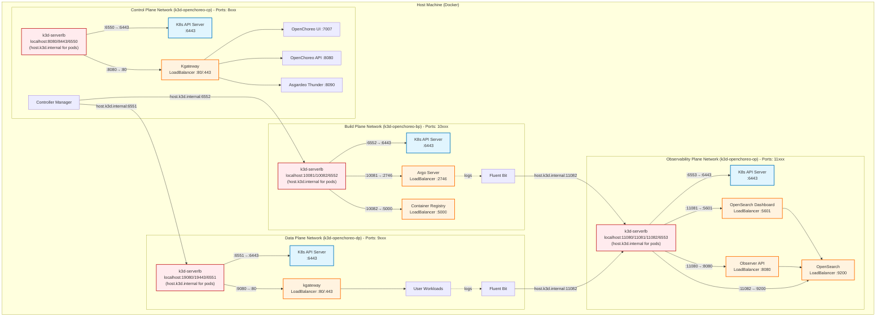

# Multi-Cluster Setup

Production-like setup with each OpenChoreo plane running in its own k3d cluster.

## Overview

This setup creates separate k3d clusters for each plane, providing better isolation and mimicking production architecture.

**Communication Architecture:**
- Uses **cluster agent** mode for secure communication between planes
- Data Plane and Build Plane agents connect to Control Plane's cluster-gateway via WebSocket
- Control Plane controllers communicate with Data/Build Planes via cluster-gateway HTTP proxy
- Secured with mutual TLS (mTLS) - each plane has its own client certificate CA
- No need to expose Data/Build Plane Kubernetes APIs externally
- Eliminates VPN requirements for multi-cluster communication

For more details on agent architecture, see [docs/multi-cluster-agent-setup.md](../../../docs/multi-cluster-agent-setup.md).

## Quick Start

> [!IMPORTANT]
> If you're using Colima, set the `K3D_FIX_DNS=0` environment variable when creating clusters.
> See [k3d-io/k3d#1449](https://github.com/k3d-io/k3d/issues/1449) for more details.
> Example: `K3D_FIX_DNS=0 k3d cluster create --config config-cp.yaml`

> [!TIP]
> For faster setup or if you have slow network, consider using [Image Preloading](#image-preloading-optional) after creating clusters.

### 1. Control Plane

Create cluster and install components:

```bash
# Create Control Plane cluster
k3d cluster create --config install/k3d/multi-cluster/config-cp.yaml

# Install Cert Manager (required for TLS certificates)
helm upgrade --install cert-manager oci://quay.io/jetstack/charts/cert-manager \
    --version v1.19.2 \
    --namespace cert-manager \
    --create-namespace \
    --set crds.enabled=true \
    --kube-context k3d-openchoreo-cp

# Wait for Cert Manager to be available
kubectl --context k3d-openchoreo-cp wait --for=condition=available deployment/cert-manager \
  -n cert-manager --timeout=120s

# Install Control Plane Helm chart
helm install openchoreo-control-plane install/helm/openchoreo-control-plane \
  --dependency-update \
  --kube-context k3d-openchoreo-cp \
  --namespace openchoreo-control-plane \
  --create-namespace \
  --values install/k3d/multi-cluster/values-cp.yaml

# Create TLS Certificate for Control Plane Gateway
kubectl apply -f - <<EOF
apiVersion: cert-manager.io/v1
kind: Certificate
metadata:
  name: control-plane-tls
  namespace: openchoreo-control-plane
spec:
  secretName: control-plane-tls
  issuerRef:
    name: openchoreo-selfsigned-issuer
    kind: ClusterIssuer
  dnsNames:
    - "*.openchoreo.localhost"
EOF

# Extract cluster-gateway server CA certificate (needed for agent configuration)
./install/extract-agent-cas.sh --control-plane-context k3d-openchoreo-cp server-ca
```

The server CA certificate will be saved to `./agent-cas/server-ca.crt`.
You'll need to paste its contents into the data plane, build plane and observability plane values files.

### 2. Data Plane

> [!IMPORTANT]
> Before installing the data plane, verify that the server CA certificate from Step 1 is already in `install/k3d/multi-cluster/values-dp.yaml` under `clusterAgent.tls.serverCAValue`.
>
> The values file in the repository already contains the CA certificate. If you regenerated it in Step 1, paste the contents of `./agent-cas/server-ca.crt` to update the values file.

Create cluster and install components:

```bash
# Create Data Plane cluster
k3d cluster create --config install/k3d/multi-cluster/config-dp.yaml

# Generate a machine-id (Required for Fluent Bit when running k3d)
docker exec k3d-openchoreo-dp-server-0 sh -c "cat /proc/sys/kernel/random/uuid | tr -d '-' > /etc/machine-id"

# Install Cert Manager (required for TLS certificates)
helm upgrade --install cert-manager oci://quay.io/jetstack/charts/cert-manager \
    --version v1.19.2 \
    --namespace cert-manager \
    --create-namespace \
    --set crds.enabled=true \
    --kube-context k3d-openchoreo-dp

# Wait for Cert Manager to be available
kubectl --context k3d-openchoreo-dp wait --for=condition=available deployment/cert-manager \
  -n cert-manager --timeout=120s

# Install Data Plane Helm chart
helm install openchoreo-data-plane install/helm/openchoreo-data-plane \
  --dependency-update \
  --kube-context k3d-openchoreo-dp \
  --namespace openchoreo-data-plane \
  --create-namespace \
  --values install/k3d/multi-cluster/values-dp.yaml

# Create TLS Certificate for Data plane gateway
kubectl apply -f - <<EOF
apiVersion: cert-manager.io/v1
kind: Certificate
metadata:
  name: openchoreo-gateway-tls
  namespace: openchoreo-data-plane
spec:
  secretName: openchoreo-gateway-tls
  issuerRef:
    name: openchoreo-selfsigned-issuer
    kind: ClusterIssuer
  dnsNames:
    - "*.openchoreoapis.localhost"
EOF
```

> [!NOTE]
> The agent will try to connect but won't succeed until you create the DataPlane resource in Step 5.

### 3. Build Plane (Optional)

> [!IMPORTANT]
> Before installing the build plane, verify that the server CA certificate from Step 1 is already in `install/k3d/multi-cluster/values-bp.yaml` under `clusterAgent.tls.serverCAValue`.
>
> The values file in the repository already contains the CA certificate. If you regenerated it in Step 1, paste the contents of `./agent-cas/server-ca.crt` to update the values file.

Create cluster and install components:

```bash
# Create Build Plane cluster
k3d cluster create --config install/k3d/multi-cluster/config-bp.yaml

# Generate a machine-id (Required for Fluent Bit when running k3d)
docker exec k3d-openchoreo-bp-server-0 sh -c "cat /proc/sys/kernel/random/uuid | tr -d '-' > /etc/machine-id"

# Install Cert Manager (required for TLS certificates)
helm upgrade --install cert-manager oci://quay.io/jetstack/charts/cert-manager \
    --version v1.19.2 \
    --namespace cert-manager \
    --create-namespace \
    --set crds.enabled=true \
    --kube-context k3d-openchoreo-bp

# Wait for Cert Manager to be available
kubectl --context k3d-openchoreo-bp wait --for=condition=available deployment/cert-manager \
  -n cert-manager --timeout=120s

# Install Container Registry (required for Build Plane)
helm repo add twuni https://twuni.github.io/docker-registry.helm
helm repo update

helm install registry twuni/docker-registry \
  --kube-context k3d-openchoreo-bp \
  --namespace openchoreo-build-plane \
  --create-namespace \
  --values install/k3d/multi-cluster/values-registry.yaml

# Install Build Plane Helm chart
helm install openchoreo-build-plane install/helm/openchoreo-build-plane \
  --dependency-update \
  --kube-context k3d-openchoreo-bp \
  --namespace openchoreo-build-plane \
  --values install/k3d/multi-cluster/values-bp.yaml
```

> [!NOTE]
> The agent will try to connect but won't succeed until you create the BuildPlane resource in Step 6.

### 4. Observability Plane (Optional)

> [!IMPORTANT]
> Before installing the observability plane, verify that the server CA certificate from Step 1 is already in `install/k3d/multi-cluster/values-op.yaml` under `clusterAgent.tls.serverCAValue`.
>
> The values file in the repository already contains the CA certificate. If you regenerated it in Step 1, paste the contents of `./agent-cas/server-ca.crt` to update the values file.

Create cluster and install components:

```bash
# Create Observability Plane cluster
k3d cluster create --config install/k3d/multi-cluster/config-op.yaml

# Generate a machine-id (Required for Fluent Bit when running k3d)
docker exec k3d-openchoreo-op-server-0 sh -c "cat /proc/sys/kernel/random/uuid | tr -d '-' > /etc/machine-id"

# Install Cert Manager (required for TLS certificates)
helm upgrade --install cert-manager oci://quay.io/jetstack/charts/cert-manager \
    --version v1.19.2 \
    --namespace cert-manager \
    --create-namespace \
    --set crds.enabled=true \
    --kube-context k3d-openchoreo-op

# Wait for Cert Manager to be available
kubectl --context k3d-openchoreo-op wait --for=condition=available deployment/cert-manager \
  -n cert-manager --timeout=120s

# Install OpenSearch Kubernetes Operator (Prerequisite)
helm repo add opensearch-operator https://opensearch-project.github.io/opensearch-k8s-operator/

helm repo update

helm install opensearch-operator opensearch-operator/opensearch-operator \
  --create-namespace \
  --namespace openchoreo-observability-plane \
  --version 2.8.0

# Install Observability Plane Helm chart
helm install openchoreo-observability-plane install/helm/openchoreo-observability-plane \
  --dependency-update \
  --kube-context k3d-openchoreo-op \
  --namespace openchoreo-observability-plane \
  --create-namespace \
  --values install/k3d/multi-cluster/values-op.yaml
```

> [!NOTE]
> The agent will try to connect but won't succeed until you create the ObservabilityPlane resource in Step 7.

### 5. Create DataPlane Resource

The `add-data-plane.sh` script automatically extracts the cluster agent's client CA certificate from the data plane and creates the DataPlane CR. All DataPlanes use cluster agent for secure communication.

```bash
# Create DataPlane CR with automatic client CA extraction
./install/add-data-plane.sh \
  --control-plane-context k3d-openchoreo-cp \
  --dataplane-context k3d-openchoreo-dp \
  --name default

# Verify the DataPlane resource was created
kubectl --context k3d-openchoreo-cp get dataplane default -n default
```

<details>
<summary>Alternative: Manual creation with secret reference</summary>

If you prefer to manage the client CA as a Kubernetes secret:

```bash
# Extract data plane agent's client CA certificate
kubectl --context k3d-openchoreo-dp get secret cluster-agent-tls \
  -n openchoreo-data-plane \
  -o jsonpath='{.data.ca\.crt}' | base64 -d > /tmp/dataplane-ca.crt

# Create secret in control plane with data plane's client CA
kubectl --context k3d-openchoreo-cp create secret generic dataplane-default-ca \
  --from-file=ca.crt=/tmp/dataplane-ca.crt \
  -n default \
  --dry-run=client -o yaml | kubectl --context k3d-openchoreo-cp apply -f -

# Create DataPlane CR referencing the secret
./install/add-data-plane.sh \
  --control-plane-context k3d-openchoreo-cp \
  --agent-ca-secret dataplane-default-ca \
  --name default
```
</details>

### 6. Install Default Resources

Install the default OpenChoreo resources (Project, Environments, DeploymentPipeline, ComponentTypes, ComponentWorkflows, and Traits):

```bash
kubectl --context k3d-openchoreo-cp apply -f samples/getting-started/all.yaml
```

Or from the remote repository:

```bash
kubectl --context k3d-openchoreo-cp apply -f https://raw.githubusercontent.com/openchoreo/openchoreo/main/samples/getting-started/all.yaml
```

### 7. Label Default Namespace

Label the default namespace to mark it as a control plane namespace:

```bash
kubectl --context k3d-openchoreo-cp label namespace default openchoreo.dev/controlplane-namespace=true
```

### 8. Create BuildPlane Resource (optional)

Similar to the DataPlane, use `add-build-plane.sh` to automatically extract and configure. All BuildPlanes use cluster agent for secure communication.

```bash
# Create BuildPlane CR with automatic client CA extraction
./install/add-build-plane.sh \
  --control-plane-context k3d-openchoreo-cp \
  --buildplane-context k3d-openchoreo-bp \
  --name default

# Verify the BuildPlane resource was created
kubectl --context k3d-openchoreo-cp get buildplane default -n default
```

<details>
<summary>Alternative: Manual creation with secret reference</summary>

If you prefer to manage the client CA as a Kubernetes secret:

```bash
# Extract build plane agent's client CA certificate
kubectl --context k3d-openchoreo-bp get secret cluster-agent-tls \
  -n openchoreo-build-plane \
  -o jsonpath='{.data.ca\.crt}' | base64 -d > /tmp/buildplane-ca.crt

# Create secret in control plane with build plane's client CA
kubectl --context k3d-openchoreo-cp create secret generic buildplane-default-ca \
  --from-file=ca.crt=/tmp/buildplane-ca.crt \
  -n default \
  --dry-run=client -o yaml | kubectl --context k3d-openchoreo-cp apply -f -

# Create BuildPlane CR referencing the secret
./install/add-build-plane.sh \
  --control-plane-context k3d-openchoreo-cp \
  --agent-ca-secret buildplane-default-ca \
  --name default
```
</details>

### 9. Create ObservabilityPlane Resource (optional)

Similar to the DataPlane and BuildPlane, use `add-observability-plane.sh` to automatically extract and configure:

```bash
# Create ObservabilityPlane CR with automatic client CA extraction
./install/add-observability-plane.sh \
  --control-plane-context k3d-openchoreo-cp \
  --observabilityplane-context k3d-openchoreo-op \
  --name default \
  --observer-url http://host.k3d.internal:11087

# Verify the ObservabilityPlane resource was created
kubectl --context k3d-openchoreo-cp get observabilityplane default -n default
```

<details>
<summary>Alternative: Manual creation with secret reference</summary>

If you prefer to manage the client CA as a Kubernetes secret:

```bash
# Extract observability plane agent's client CA certificate
kubectl --context k3d-openchoreo-op get secret cluster-agent-tls \
  -n openchoreo-observability-plane \
  -o jsonpath='{.data.ca\.crt}' | base64 -d > /tmp/observabilityplane-ca.crt

# Create secret in control plane with observability plane's client CA
kubectl --context k3d-openchoreo-cp create secret generic observabilityplane-default-ca \
  --from-file=ca.crt=/tmp/observabilityplane-ca.crt \
  -n default \
  --dry-run=client -o yaml | kubectl --context k3d-openchoreo-cp apply -f -

# Create ObservabilityPlane CR referencing the secret
./install/add-observability-plane.sh \
  --control-plane-context k3d-openchoreo-cp \
  --agent-ca-secret observabilityplane-default-ca \
  --name default \
  --observer-url http://host.k3d.internal:11087
```
</details>

### 10. Configure DataPlane to use default ObservabilityPlane (Optional)
```
kubectl --context k3d-openchoreo-cp patch dataplane default -n default --type merge -p '{"spec":{"observabilityPlaneRef":"default"}}'
```

### 11. Configure BuildPlane (if installed) to use default ObservabilityPlane
```
kubectl --context k3d-openchoreo-cp patch buildplane default -n default --type merge -p '{"spec":{"observabilityPlaneRef":"default"}}'
```

## Port Mappings

| Plane               | Cluster           | Kube API Port | Port Range |
|---------------------|-------------------|---------------|------------|
| Control Plane       | k3d-openchoreo-cp | 6550          | 8xxx       |
| Data Plane          | k3d-openchoreo-dp | 6551          | 9xxx       |
| Build Plane         | k3d-openchoreo-bp | 6552          | 10xxx      |
| Observability Plane | k3d-openchoreo-op | 6553          | 11xxx      |

> [!NOTE]
> - Port ranges (e.g., 8xxx) indicate the ports exposed to your host machine for accessing services from that plane. Each range uses ports like 8080 (HTTP) and 8443 (HTTPS) on localhost.
> - **Cluster Gateway**: Control Plane's cluster-gateway is accessible at `wss://cluster-gateway.openchoreo.localhost:8443/ws` from other k3d clusters (routed through the same Kgateway)

## Access Services

### Control Plane

- OpenChoreo UI: http://openchoreo.localhost:8080
- OpenChoreo API: http://api.openchoreo.localhost:8080
- Asgardeo Thunder: http://thunder.openchoreo.localhost:8080
- Cluster Gateway: wss://cluster-gateway.openchoreo.localhost:8443/ws (for agent connections)

### Data Plane

- User Workloads: http://localhost:19080 (kgateway)

### Build Plane (if installed)

- Argo Workflows UI: http://localhost:10081
- Container Registry: http://localhost:10082

### Observability Plane (if installed)

- Observer API: http://localhost:11087
- OpenSearch API: http://localhost:11082 (for Fluent Bit and direct API access)
- Prometheus: http://localhost:11083 (for metrics)

## Verification

### Check Component Status

```bash
# Control Plane
kubectl --context k3d-openchoreo-cp get pods -n openchoreo-control-plane

# Data Plane
kubectl --context k3d-openchoreo-dp get pods -n openchoreo-data-plane

# Build Plane
kubectl --context k3d-openchoreo-bp get pods -n openchoreo-build-plane

# Observability Plane
kubectl --context k3d-openchoreo-op get pods -n openchoreo-observability-plane

# Verify DataPlane resource in Control Plane
kubectl --context k3d-openchoreo-cp get dataplane -n default

# Verify BuildPlane resource in Control Plane (if created)
kubectl --context k3d-openchoreo-cp get buildplane -n default

# Verify ObservabilityPlane resource in Control Plane (if created)
kubectl --context k3d-openchoreo-cp get observabilityplane -n default
```

### Verify Agent Connections

Check that cluster agents are connected to the cluster-gateway:

```bash
# Check cluster-gateway logs for agent connections
kubectl --context k3d-openchoreo-cp logs -n openchoreo-control-plane \
  -l app.kubernetes.io/component=cluster-gateway --tail=50

# Expected output should include:
# {"level":"INFO","msg":"agent registered","component":"connection-manager","planeIdentifier":"dataplane/default","connectionID":"...","totalConnections":1}
# {"level":"INFO","msg":"agent connected successfully","component":"agent-server","planeType":"dataplane","planeName":"default","planeIdentifier":"dataplane/default"}
# {"level":"INFO","msg":"certificate verification successful","component":"agent-server","clientCN":"default"}

# Check data plane agent logs
kubectl --context k3d-openchoreo-dp logs -n openchoreo-data-plane \
  -l app.kubernetes.io/component=cluster-agent --tail=20

# Expected output:
# {"level":"INFO","msg":"connected to control plane","component":"agent","plane":"default"}
# {"level":"INFO","msg":"starting agent","component":"agent","plane":"default","planeType":"dataplane","planeName":"default"}

# Check build plane agent logs (if installed)
kubectl --context k3d-openchoreo-bp logs -n openchoreo-build-plane \
  -l app.kubernetes.io/component=cluster-agent --tail=20

# Verify agent is maintaining connection
kubectl --context k3d-openchoreo-cp get pods -n openchoreo-control-plane \
  -l app.kubernetes.io/component=cluster-gateway
kubectl --context k3d-openchoreo-dp get pods -n openchoreo-data-plane \
  -l app.kubernetes.io/component=cluster-agent

# Check observability plane agent logs (if installed)
kubectl --context k3d-openchoreo-op logs -n openchoreo-observability-plane \
  -l app.kubernetes.io/component=cluster-agent --tail=20

# Verify agent is maintaining connection
kubectl --context k3d-openchoreo-cp get pods -n openchoreo-control-plane \
  -l app.kubernetes.io/component=cluster-gateway
kubectl --context k3d-openchoreo-op get pods -n openchoreo-observability-plane \
  -l app.kubernetes.io/component=cluster-agent
```

## Architecture



## Image Preloading (Optional)

If you have slow network or want to save bandwidth when re-creating clusters, you can preload images before installing components. This pulls images to your host machine first, then imports them to each k3d cluster, which is significantly faster than pulling from within the clusters.

**Control Plane:**
```bash
install/k3d/preload-images.sh \
  --cluster openchoreo-cp \
  --local-charts \
  --control-plane --cp-values install/k3d/multi-cluster/values-cp.yaml \
  --parallel 4
```

**Data Plane:**
```bash
install/k3d/preload-images.sh \
  --cluster openchoreo-dp \
  --local-charts \
  --data-plane --dp-values install/k3d/multi-cluster/values-dp.yaml \
  --parallel 4
```

**Build Plane (optional):**
```bash
install/k3d/preload-images.sh \
  --cluster openchoreo-bp \
  --local-charts \
  --build-plane --bp-values install/k3d/multi-cluster/values-bp.yaml \
  --parallel 4
```

**Observability Plane (optional):**
```bash
install/k3d/preload-images.sh \
  --cluster openchoreo-op \
  --local-charts \
  --observability-plane --op-values install/k3d/multi-cluster/values-op.yaml \
  --parallel 4
```

Run this after creating the clusters (step 1) but before installing components (step 2).

## Troubleshooting

### DNS Resolution Issues in Agents

If you see errors like `no such host` or `lookup ... i/o timeout` in agent logs:

```bash
# Check if CoreDNS custom config exists
kubectl --context k3d-openchoreo-dp get configmap coredns-custom -n kube-system

# Check if DNS rewrite is enabled in values file
grep -A2 dnsRewrite install/k3d/multi-cluster/values-dp.yaml

# Test DNS resolution
kubectl --context k3d-openchoreo-dp run test-dns --image=busybox --rm -it --restart=Never -- \
  nslookup cluster-gateway.openchoreo.localhost

# Expected output: Should resolve to 192.168.5.2 (host.k3d.internal)

# If DNS is not working, restart CoreDNS
kubectl --context k3d-openchoreo-dp rollout restart deployment coredns -n kube-system
```

## Cleanup

Delete all clusters:

```bash
k3d cluster delete openchoreo-cp openchoreo-dp openchoreo-bp openchoreo-op
```
