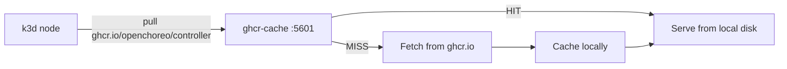

# Registry Pull-Through Cache

A Compose setup that runs local pull-through caches for container registries used by OpenChoreo.
This speeds up repeated image pulls during local development.

## How It Works

Each cache is a `registry:2` instance configured as a pull-through proxy for one upstream registry.
On first pull, the image is fetched from the upstream and cached locally. Subsequent pulls (by any
client using the cache) are served from local disk.



If the caches are not running, containerd falls back to pulling directly from the upstream
registry.

## Ports

| Port | Upstream        |
|------|-----------------|
| 5601 | ghcr.io         |
| 5602 | docker.io       |
| 5603 | quay.io         |
| 5604 | cr.kgateway.dev |

## Quick Start

```bash
# Start all caches
docker compose up -d

# Verify they're running
docker compose ps
```

Then create your k3d cluster with the registry mirrors. Add this to your k3d config's
`registries` section (or pass via `--registry-config`):

```yaml
registries:
  config: |
    mirrors:
      "ghcr.io":
        endpoint:
          - http://host.k3d.internal:5601
      "docker.io":
        endpoint:
          - http://host.k3d.internal:5602
      "quay.io":
        endpoint:
          - http://host.k3d.internal:5603
      "cr.kgateway.dev":
        endpoint:
          - http://host.k3d.internal:5604
```

## Browsing Cached Images

```bash
# List all cached repo:tag pairs
./list-cached.sh

# List only ghcr cache
./list-cached.sh ghcr-cache
```

## Refreshing Mutable Tags

Mutable tags like `latest-dev` get cached on first pull. If upstream publishes a new image
under the same tag, the cache will continue serving the old version.

Use the purge script to invalidate stale images:

```bash
# Purge a specific image:tag
./purge-cache.sh openchoreo/controller:latest-dev

# Purge all tags of a repo
./purge-cache.sh openchoreo/controller

# Purge all openchoreo repos
./purge-cache.sh openchoreo/*

# Purge from any registry (auto-detected)
./purge-cache.sh external-secrets/external-secrets:v2.0.1

# Purge everything from all caches
./purge-cache.sh --all
```

## Cleanup

```bash
# Stop caches (cached data preserved in Docker volumes)
docker compose down

# Stop and clear all cached data
docker compose down -v
```
