# Single-Cluster Setup

All-in-one OpenChoreo setup with all planes running in a single k3d cluster.

## Overview

This setup creates one k3d cluster that hosts all OpenChoreo planes, providing a simpler development environment with
lower resource requirements.

## Quick Start

> [!IMPORTANT]
> If you're using Colima, set the `K3D_FIX_DNS=0` environment variable when creating clusters.
> See [k3d-io/k3d#1449](https://github.com/k3d-io/k3d/issues/1449) for more details.
> Example: `K3D_FIX_DNS=0 k3d cluster create --config install/k3d/single-cluster/config.yaml`

> [!TIP]
> For faster setup or if you have slow network, consider using [Image Preloading](#image-preloading-optional) after creating the cluster.

### 1. Create Cluster

```bash
# Create single OpenChoreo cluster
k3d cluster create --config install/k3d/single-cluster/config.yaml

# Generate a machine-id (Required for Fluent Bit when running k3d)
docker exec k3d-openchoreo-server-0 sh -c "cat /proc/sys/kernel/random/uuid | tr -d '-' > /etc/machine-id"
```

### 2. Install Prerequisites

#### Gateway API CRDs

```bash
kubectl apply --context k3d-openchoreo --server-side \
  -f https://github.com/kubernetes-sigs/gateway-api/releases/download/v1.4.1/experimental-install.yaml
```

#### cert-manager

```bash
helm upgrade --install cert-manager oci://quay.io/jetstack/charts/cert-manager \
  --kube-context k3d-openchoreo \
  --namespace cert-manager \
  --create-namespace \
  --version v1.19.2 \
  --set crds.enabled=true

kubectl wait --context k3d-openchoreo \
  --for=condition=Available deployment/cert-manager \
  -n cert-manager --timeout=180s
```

#### External Secrets Operator

```bash
helm upgrade --install external-secrets oci://ghcr.io/external-secrets/charts/external-secrets \
  --kube-context k3d-openchoreo \
  --namespace external-secrets \
  --create-namespace \
  --version 1.3.2 \
  --set installCRDs=true

kubectl wait --context k3d-openchoreo \
  --for=condition=Available deployment/external-secrets \
  -n external-secrets --timeout=180s
```

#### kgateway

```bash
helm upgrade --install kgateway-crds oci://cr.kgateway.dev/kgateway-dev/charts/kgateway-crds \
  --kube-context k3d-openchoreo \
  --version v2.1.1

helm upgrade --install kgateway oci://cr.kgateway.dev/kgateway-dev/charts/kgateway \
  --kube-context k3d-openchoreo \
  --namespace openchoreo-control-plane \
  --create-namespace \
  --version v2.1.1
```

#### Thunder (Asgardeo Identity Provider)

```bash
helm upgrade --install thunder oci://ghcr.io/asgardeo/helm-charts/thunder \
  --kube-context k3d-openchoreo \
  --namespace openchoreo-control-plane \
  --version 0.21.0 \
  --values install/k3d/common/values-thunder.yaml
```

### 3. Install Components

> [!NOTE]
> This setup uses **cluster gateway and agents** by default for secure communication between Control Plane and Data/Build Planes. The agents connect via in-cluster service (`cluster-gateway.openchoreo-control-plane.svc.cluster.local`) using mTLS authentication.

Install all planes in the single cluster:

```bash
# Control Plane
helm upgrade --install openchoreo-control-plane install/helm/openchoreo-control-plane \
  --kube-context k3d-openchoreo \
  --namespace openchoreo-control-plane \
  --create-namespace \
  --values install/k3d/single-cluster/values-cp.yaml

# Wait for cluster-gateway to be ready (required for agent connections)
kubectl --context k3d-openchoreo wait --for=condition=available deployment/cluster-gateway \
  -n openchoreo-control-plane --timeout=120s

# If envoy is crashing due to missing /tmp directory, patch the deployment to add an emptyDir volume for /tmp
# Ref: https://github.com/kgateway-dev/kgateway/issues/9800
kubectl patch deployment gateway-default -n openchoreo-control-plane --type='json' -p='[
  {"op": "add", "path": "/spec/template/spec/volumes/-", "value": {"name": "tmp", "emptyDir": {}}},
  {"op": "add", "path": "/spec/template/spec/containers/0/volumeMounts/-", "value": {"name": "tmp", "mountPath": "/tmp"}}
]'

# Data Plane

# Copy the cluster-gateway CA from control plane to data plane namespace
CA_CRT=$(kubectl --context k3d-openchoreo get configmap cluster-gateway-ca \
  -n openchoreo-control-plane -o jsonpath='{.data.ca\.crt}')

kubectl --context k3d-openchoreo create configmap cluster-gateway-ca \
  --from-literal=ca.crt="$CA_CRT" \
  -n openchoreo-data-plane

# Create fake ClusterSecretStore for development
kubectl --context k3d-openchoreo apply -f - <<EOF
apiVersion: external-secrets.io/v1
kind: ClusterSecretStore
metadata:
  name: default
spec:
  provider:
    fake:
      data:
      - key: npm-token
        value: "fake-npm-token-for-development"
      - key: docker-username
        value: "dev-user"
      - key: docker-password
        value: "dev-password"
      - key: github-pat
        value: "fake-github-token-for-development"
      - key: username
        value: "dev-user"
      - key: password
        value: "dev-password"
      - key: RCA_LLM_API_KEY
        value: "fake-llm-api-key-for-development"
EOF

helm upgrade --install openchoreo-data-plane install/helm/openchoreo-data-plane \
  --dependency-update \
  --kube-context k3d-openchoreo \
  --namespace openchoreo-data-plane \
  --create-namespace \
  --values install/k3d/single-cluster/values-dp.yaml

# If envoy is crashing due to missing /tmp directory, patch the deployment to add an emptyDir volume for /tmp
# Ref: https://github.com/kgateway-dev/kgateway/issues/9800
kubectl patch deployment gateway-default -n openchoreo-data-plane --type='json' -p='[
  {"op": "add", "path": "/spec/template/spec/volumes/-", "value": {"name": "tmp", "emptyDir": {}}},
  {"op": "add", "path": "/spec/template/spec/containers/0/volumeMounts/-", "value": {"name": "tmp", "mountPath": "/tmp"}}
]'

# Build Plane (optional)
# The Build Plane requires a container registry. Install the registry first, then the build plane.

# Install Container Registry
helm repo add twuni https://twuni.github.io/docker-registry.helm
helm repo update

helm install registry twuni/docker-registry \
  --kube-context k3d-openchoreo \
  --namespace openchoreo-build-plane \
  --create-namespace \
  --values install/k3d/single-cluster/values-registry.yaml

# Install Build Plane
helm upgrade --install openchoreo-build-plane install/helm/openchoreo-build-plane \
  --dependency-update \
  --kube-context k3d-openchoreo \
  --namespace openchoreo-build-plane \
  --values install/k3d/single-cluster/values-bp.yaml

# Observability Plane (optional)

## Non-HA mode
helm upgrade --install openchoreo-observability-plane install/helm/openchoreo-observability-plane \
  --dependency-update \
  --kube-context k3d-openchoreo \
  --namespace openchoreo-observability-plane \
  --create-namespace \
  --values install/k3d/single-cluster/values-op.yaml \
  --set openSearch.enabled=true \
  --set openSearchCluster.enabled=false

# If envoy is crashing due to missing /tmp directory, patch the deployment to add an emptyDir volume for /tmp
# Ref: https://github.com/kgateway-dev/kgateway/issues/9800
kubectl patch deployment gateway-default -n openchoreo-observability-plane --type='json' -p='[
  {"op": "add", "path": "/spec/template/spec/volumes/-", "value": {"name": "tmp", "emptyDir": {}}},
  {"op": "add", "path": "/spec/template/spec/containers/0/volumeMounts/-", "value": {"name": "tmp", "mountPath": "/tmp"}}
]'

## HA mode

### OpenSearch Kubernetes Operator (Prerequisite)
helm repo add opensearch-operator https://opensearch-project.github.io/opensearch-k8s-operator/

helm repo update

helm install opensearch-operator opensearch-operator/opensearch-operator \
  --create-namespace \
  --namespace openchoreo-observability-plane \
  --version 2.8.0

### OpenChoreo Observability Plane
helm install openchoreo-observability-plane install/helm/openchoreo-observability-plane \
  --dependency-update \
  --kube-context k3d-openchoreo \
  --namespace openchoreo-observability-plane \
  --create-namespace \
  --values install/k3d/single-cluster/values-op.yaml

# If envoy is crashing due to missing /tmp directory, patch the deployment to add an emptyDir volume for /tmp
# Ref: https://github.com/kgateway-dev/kgateway/issues/9800
kubectl patch deployment gateway-default -n openchoreo-observability-plane --type='json' -p='[
  {"op": "add", "path": "/spec/template/spec/volumes/-", "value": {"name": "tmp", "emptyDir": {}}},
  {"op": "add", "path": "/spec/template/spec/containers/0/volumeMounts/-", "value": {"name": "tmp", "mountPath": "/tmp"}}
]'
```

### 4. Create TLS Certificates for Gateways

```bash
# Control plane gateway TLS Certificate
kubectl apply -f - <<EOF
apiVersion: cert-manager.io/v1
kind: Certificate
metadata:
  name: control-plane-tls
  namespace: openchoreo-control-plane
spec:
  secretName: control-plane-tls
  issuerRef:
    name: openchoreo-selfsigned-issuer
    kind: ClusterIssuer
  dnsNames:
    - "*.openchoreo.localhost"
EOF

# Data plane gateway TLS Certificate
kubectl apply -f - <<EOF
apiVersion: cert-manager.io/v1
kind: Certificate
metadata:
  name: openchoreo-gateway-tls
  namespace: openchoreo-data-plane
spec:
  secretName: openchoreo-gateway-tls
  issuerRef:
    name: openchoreo-selfsigned-issuer
    kind: ClusterIssuer
  dnsNames:
    - "*.openchoreoapis.localhost"
EOF
```

### 5. Create DataPlane Resource

Create a DataPlane resource to enable workload deployment. All DataPlanes use cluster agent for secure communication.

```bash
./install/add-data-plane.sh \
  --control-plane-context k3d-openchoreo \
  --name default
```

The cluster agent establishes an outbound WebSocket connection to the cluster gateway, eliminating the need to expose the data plane Kubernetes API.

### 6. Install Default Resources

Install the default OpenChoreo resources (Project, Environments, DeploymentPipeline, ComponentTypes, ComponentWorkflows, and Traits):

```bash
kubectl --context k3d-openchoreo apply -f samples/getting-started/all.yaml
```

Or from the remote repository:

```bash
kubectl --context k3d-openchoreo apply -f https://raw.githubusercontent.com/openchoreo/openchoreo/main/samples/getting-started/all.yaml
```

### 7. Label Default Namespace

Label the default namespace to mark it as a control plane namespace:

```bash
kubectl label namespace default openchoreo.dev/controlplane-namespace=true
```

### 8. Create BuildPlane Resource (optional)

Create a BuildPlane resource to enable building from source. All BuildPlanes use cluster agent for secure communication.

```bash
./install/add-build-plane.sh \
  --control-plane-context k3d-openchoreo \
  --name default
```

The cluster agent establishes an outbound WebSocket connection to the cluster gateway, providing secure communication without exposing the Kubernetes API server.

### 9. Create ObservabilityPlane Resource (optional)

Create a ObservabilityPlane resource to enable observability in data plane and build plane.

```bash
./install/add-observability-plane.sh \
  --control-plane-context k3d-openchoreo \
  --name default \
  --observer-url http://observer.openchoreo.localhost:11080
```
The agent establishes an outbound WebSocket connection to the cluster gateway, providing secure communication without exposing the Kubernetes API server.

Configure DataPlane to use default ObservabilityPlane
```bash
kubectl patch dataplane default -n default --type merge -p '{"spec":{"observabilityPlaneRef":{"kind":"ObservabilityPlane","name":"default"}}}'
```

Configure BuildPlane (if installed) to use default ObservabilityPlane
```bash
kubectl patch buildplane default -n default --type merge -p '{"spec":{"observabilityPlaneRef":{"kind":"ObservabilityPlane","name":"default"}}}'
```

Enable logs collection by upgrading the observability plane with Fluent Bit enabled:
```bash
helm upgrade openchoreo-observability-plane install/helm/openchoreo-observability-plane \
  --kube-context k3d-openchoreo \
  --namespace openchoreo-observability-plane \
  --reuse-values \
  --set fluent-bit.enabled=true \
  --timeout 10m
```

## Port Mappings

| Plane               | Namespace                      | Kube API Port | Port Range |
|---------------------|--------------------------------|---------------|------------|
| Control Plane       | openchoreo-control-plane       | 6550          | 8xxx       |
| Data Plane          | openchoreo-data-plane          | -             | 9xxx       |
| Build Plane         | openchoreo-build-plane         | -             | 10xxx      |
| Observability Plane | openchoreo-observability-plane | -             | 11xxx      |

> [!NOTE]
> Port ranges (e.g., 8xxx) indicate the ports exposed to your host machine for accessing services from that plane. Each
> range uses ports like 8080 (HTTP) and 8443 (HTTPS) on localhost. In single-cluster mode, all planes share the same
> Kubernetes API (port 6550).

## Access Services

### Control Plane

- OpenChoreo UI: http://openchoreo.localhost:8080
- OpenChoreo API: http://api.openchoreo.localhost:8080
- Asgardeo Thunder: http://thunder.openchoreo.localhost:8080

### Data Plane

- User Workloads: http://localhost:19080 (kgateway)

### Build Plane (if installed)

- Argo Workflows UI: http://localhost:10081
- Container Registry: http://localhost:10082

### Observability Plane (if installed)

- Observer API: http://localhost:11080
- OpenSearch API: http://localhost:11082 (for Fluent Bit and direct API access)

## Verification

Check that all components are running:

```bash
# Control Plane
kubectl --context k3d-openchoreo get pods -n openchoreo-control-plane

# Data Plane
kubectl --context k3d-openchoreo get pods -n openchoreo-data-plane

# Build Plane
kubectl --context k3d-openchoreo get pods -n openchoreo-build-plane

# Observability Plane
kubectl --context k3d-openchoreo get pods -n openchoreo-observability-plane

# Verify DataPlane resource
kubectl --context k3d-openchoreo get dataplane -n default

# Verify BuildPlane resource (if created)
kubectl --context k3d-openchoreo get buildplane -n default

# Verify ObservabilityPlane resource (if created)
kubectl --context k3d-openchoreo get observabilityplane -n default

# Verify Cluster Agent Connection (if using agent mode)
echo "=== Data Plane Cluster Agent Status ==="
kubectl --context k3d-openchoreo get pods -n openchoreo-data-plane -l app=cluster-agent

echo "=== Data Plane Agent Connection Logs ==="
kubectl --context k3d-openchoreo logs -n openchoreo-data-plane -l app=cluster-agent --tail=5 | grep "connected to control plane"

echo "=== Build Plane Cluster Agent Status ==="
kubectl --context k3d-openchoreo get pods -n openchoreo-build-plane -l app=cluster-agent

echo "=== Build Plane Agent Connection Logs ==="
kubectl --context k3d-openchoreo logs -n openchoreo-build-plane -l app=cluster-agent --tail=5 | grep "connected to control plane"

echo "=== Observability Plane Cluster Agent Status ==="
kubectl --context k3d-openchoreo get pods -n openchoreo-observability-plane -l app=cluster-agent

echo "=== Observability Plane Agent Connection Logs ==="
kubectl --context k3d-openchoreo logs -n openchoreo-observability-plane -l app=cluster-agent --tail=5 | grep "connected to control plane"

echo "=== Gateway Registration ==="
kubectl --context k3d-openchoreo logs -n openchoreo-control-plane -l app=cluster-gateway | grep "agent registered" | tail -5
```

## Architecture

```mermaid
graph TB
    subgraph "Host Machine (Docker)"
        subgraph "Single k3d Cluster (k3d-openchoreo)"
            ExtLB["k3d-serverlb<br/>localhost:6550/8080/8443/19080/19443/10081/10082/11080/11081/11082"]
            K8sAPI["K8s API Server<br/>:6443"]

            subgraph "Control Plane Namespace"
                CP_IntLB["Kgateway<br/>LoadBalancer :80/:443"]
                CP["Controller Manager"]
                API["OpenChoreo API :8080"]
                UI["OpenChoreo UI :7007"]
                Thunder["Asgardeo Thunder :8090"]
            end

            subgraph "Data Plane Namespace"
                DP_IntLB["kgateway<br/>LoadBalancer :19080/:19443"]
                Workloads["User Workloads"]
                FB_ALL["Fluent Bit DaemonSet<br/>Collects logs from ALL namespaces<br/>(CP + DP + BP + OP)"]
            end

            subgraph "Build Plane Namespace"
                BP_IntLB["Argo Server<br/>LoadBalancer :10081"]
                Registry["Container Registry<br/>LoadBalancer :5000"]
                ArgoWF["Argo Workflows"]
            end

            subgraph "Observability Plane Namespace"
                Observer["Observer API<br/>LoadBalancer :11080"]
                OSD["OpenSearch Dashboard<br/>LoadBalancer :11081"]
                OS["OpenSearch<br/>LoadBalancer :11082"]
            end

            %% External access via load balancer
            ExtLB -->|":6550→:6443"| K8sAPI
            ExtLB -->|":8080→:80"| CP_IntLB
            ExtLB -->|":9080→:19080"| DP_IntLB
            ExtLB -->|":10081→:10081"| BP_IntLB
            ExtLB -->|":10082→:5000"| Registry
            ExtLB -->|":11080→:11080"| Observer
            ExtLB -->|":11081→:11081"| OSD
            ExtLB -->|":11082→:11082"| OS

            %% Control plane internal routing
            CP_IntLB --> UI
            CP_IntLB --> API
            CP_IntLB --> Thunder

            %% Data plane internal routing
            DP_IntLB --> Workloads
            BP_IntLB --> ArgoWF

            %% Control plane to workload communication (in-cluster)
            CP -->|"In-cluster"| Workloads
            CP -->|"In-cluster"| ArgoWF

            %% Logging flow - ALL logs go through Data Plane FluentBit
            FB_ALL -->|"In-cluster<br/>opensearch.openchoreo-observability-plane:9200"| OS

            %% Observability internal
            Observer --> OS
            OSD --> OS
        end
    end

    %% Styling
    classDef extLbStyle fill:#ffebee,stroke:#c62828,stroke-width:2px
    classDef intLbStyle fill:#fff3e0,stroke:#ff6f00,stroke-width:2px
    classDef apiStyle fill:#e1f5fe,stroke:#0277bd,stroke-width:2px

    class ExtLB extLbStyle
    class CP_IntLB,DP_IntLB,BP_IntLB,Registry,Observer,OSD,OS intLbStyle
    class K8sAPI apiStyle
```



## Image Preloading (Optional)

If you have slow network or want to save bandwidth when re-creating clusters, you can preload images before installing components. This pulls images to your host machine first, then imports them to the k3d cluster, which is significantly faster than pulling from within the cluster.

**Control Plane and Data Plane:**
```bash
install/k3d/preload-images.sh \
  --cluster openchoreo \
  --local-charts \
  --control-plane --cp-values install/k3d/single-cluster/values-cp.yaml \
  --data-plane --dp-values install/k3d/single-cluster/values-dp.yaml \
  --parallel 4
```

**With Build Plane:**
```bash
install/k3d/preload-images.sh \
  --cluster openchoreo \
  --local-charts \
  --control-plane --cp-values install/k3d/single-cluster/values-cp.yaml \
  --data-plane --dp-values install/k3d/single-cluster/values-dp.yaml \
  --build-plane --bp-values install/k3d/single-cluster/values-bp.yaml \
  --parallel 4
```

**With all planes including Observability:**
```bash
install/k3d/preload-images.sh \
  --cluster openchoreo \
  --local-charts \
  --control-plane --cp-values install/k3d/single-cluster/values-cp.yaml \
  --data-plane --dp-values install/k3d/single-cluster/values-dp.yaml \
  --build-plane --bp-values install/k3d/single-cluster/values-bp.yaml \
  --observability-plane --op-values install/k3d/single-cluster/values-op.yaml \
  --parallel 4
```

Run this after creating the cluster (step 1) but before installing components (step 2).

## Cleanup

Delete the cluster:

```bash
k3d cluster delete openchoreo
```
