# Single-Cluster Setup

All-in-one OpenChoreo setup with all planes running in a single k3d cluster.

## Overview

This setup creates one k3d cluster that hosts all OpenChoreo planes, providing a simpler development environment with
lower resource requirements.

## Quick Start

> [!IMPORTANT]
> If you're using Colima, set the `K3D_FIX_DNS=0` environment variable when creating clusters.
> See [k3d-io/k3d#1449](https://github.com/k3d-io/k3d/issues/1449) for more details.
> Example: `K3D_FIX_DNS=0 k3d cluster create --config install/k3d/single-cluster/config.yaml`

> [!TIP]
> For faster setup or if you have slow network, consider using [Image Preloading](#image-preloading-optional) after creating the cluster.

### 1. Create Cluster

```bash
# Create single OpenChoreo cluster
k3d cluster create --config install/k3d/single-cluster/config.yaml
```

### 2. Install Components

Install all planes in the single cluster:

```bash
# Control Plane
helm install openchoreo-control-plane install/helm/openchoreo-control-plane \
  --dependency-update \
  --kube-context k3d-openchoreo \
  --namespace openchoreo-control-plane \
  --create-namespace \
  --values install/k3d/single-cluster/values-cp.yaml

# Data Plane
helm install openchoreo-data-plane install/helm/openchoreo-data-plane \
  --dependency-update \
  --kube-context k3d-openchoreo \
  --namespace openchoreo-data-plane \
  --create-namespace \
  --values install/k3d/single-cluster/values-dp.yaml

# Build Plane (optional)
helm install openchoreo-build-plane install/helm/openchoreo-build-plane \
  --dependency-update \
  --kube-context k3d-openchoreo \
  --namespace openchoreo-build-plane \
  --create-namespace \
  --values install/k3d/single-cluster/values-bp.yaml

# Observability Plane (optional)
## OpenSearch Kubernetes Operator (Prerequisite)
helm repo add opensearch-operator https://opensearch-project.github.io/opensearch-k8s-operator/

helm repo update

helm install opensearch-operator opensearch-operator/opensearch-operator \
  --create-namespace \
  --namespace openchoreo-observability-plane \
  --version 2.8.0

## OpenChoreo Observability Plane
helm install openchoreo-observability-plane install/helm/openchoreo-observability-plane \
  --dependency-update \
  --kube-context k3d-openchoreo \
  --namespace openchoreo-observability-plane \
  --create-namespace \
  --values install/k3d/single-cluster/values-op.yaml
```

### 3. Create DataPlane Resource

Create a DataPlane resource to enable workload deployment.

**Using Cluster Agent (Recommended):**

The cluster agent provides secure communication between control plane and data plane without exposing the Kubernetes API:

```bash
./install/add-data-plane.sh \
  --enable-agent \
  --control-plane-context k3d-openchoreo \
  --namespace default \
  --agent-ca-namespace openchoreo-control-plane \
  --name default
```

This creates a DataPlane CR that uses the cluster agent for communication. The agent establishes an outbound WebSocket connection to the cluster gateway, eliminating the need to expose the data plane Kubernetes API.

**Using Direct API Access (Alternative):**

For simple setups or testing, you can use direct Kubernetes API access:

```bash
./install/add-data-plane.sh --control-plane-context k3d-openchoreo
```

> **Note:** The cluster agent approach is recommended for production deployments as it provides better security and doesn't require exposing the Kubernetes API server.

### 4. Create BuildPlane Resource (optional)

Create a BuildPlane resource to enable building from source:

```bash
./install/add-build-plane.sh --control-plane-context k3d-openchoreo
```

## Port Mappings

| Plane               | Namespace                      | Kube API Port | Port Range |
|---------------------|--------------------------------|---------------|------------|
| Control Plane       | openchoreo-control-plane       | 6550          | 8xxx       |
| Data Plane          | openchoreo-data-plane          | -             | 9xxx       |
| Build Plane         | openchoreo-build-plane         | -             | 10xxx      |
| Observability Plane | openchoreo-observability-plane | -             | 11xxx      |

> [!NOTE]
> Port ranges (e.g., 8xxx) indicate the ports exposed to your host machine for accessing services from that plane. Each
> range uses ports like 8080 (HTTP) and 8443 (HTTPS) on localhost. In single-cluster mode, all planes share the same
> Kubernetes API (port 6550).

## Access Services

### Control Plane

- OpenChoreo UI: http://openchoreo.localhost:8080
- OpenChoreo API: http://api.openchoreo.localhost:8080
- Asgardeo Thunder: http://thunder.openchoreo.localhost:8080

### Data Plane

- User Workloads: http://localhost:9080 (Envoy Gateway)

### Build Plane (if installed)

- Argo Workflows UI: http://localhost:10081
- Container Registry: http://localhost:10082

### Observability Plane (if installed)

- Observer API: http://localhost:11080
- OpenSearch Dashboard: http://localhost:11081
- OpenSearch API: http://localhost:11082 (for Fluent Bit and direct API access)

## Verification

Check that all components are running:

```bash
# Control Plane
kubectl --context k3d-openchoreo get pods -n openchoreo-control-plane

# Data Plane
kubectl --context k3d-openchoreo get pods -n openchoreo-data-plane

# Build Plane
kubectl --context k3d-openchoreo get pods -n openchoreo-build-plane

# Observability Plane
kubectl --context k3d-openchoreo get pods -n openchoreo-observability-plane

# Verify DataPlane resource
kubectl --context k3d-openchoreo get dataplane -n default

# Verify BuildPlane resource (if created)
kubectl --context k3d-openchoreo get buildplane -n default

# Verify Cluster Agent Connection (if using agent mode)
echo "=== Cluster Agent Status ==="
kubectl --context k3d-openchoreo get pods -n openchoreo-data-plane -l app=cluster-agent

echo "=== Agent Connection Logs ==="
kubectl --context k3d-openchoreo logs -n openchoreo-data-plane -l app=cluster-agent --tail=5 | grep "connected to control plane"

echo "=== Gateway Registration ==="
kubectl --context k3d-openchoreo logs -n openchoreo-control-plane -l app=cluster-gateway | grep "agent registered" | tail -1
```

## Architecture

```mermaid
graph TB
    subgraph "Host Machine (Docker)"
        subgraph "Single k3d Cluster (k3d-openchoreo)"
            ExtLB["k3d-serverlb<br/>localhost:6550/8080/8443/9080/9443/10081/10082/11080/11081/11082"]
            K8sAPI["K8s API Server<br/>:6443"]

            subgraph "Control Plane Namespace"
                CP_IntLB["Traefik<br/>LoadBalancer :80/:443"]
                CP["Controller Manager"]
                API["OpenChoreo API :8080"]
                UI["OpenChoreo UI :7007"]
                Thunder["Asgardeo Thunder :8090"]
            end

            subgraph "Data Plane Namespace"
                DP_IntLB["Envoy Gateway<br/>LoadBalancer :9080/:9443"]
                Workloads["User Workloads"]
                FB_ALL["Fluent Bit DaemonSet<br/>Collects logs from ALL namespaces<br/>(CP + DP + BP + OP)"]
            end

            subgraph "Build Plane Namespace"
                BP_IntLB["Argo Server<br/>LoadBalancer :10081"]
                Registry["Container Registry<br/>LoadBalancer :5000"]
                ArgoWF["Argo Workflows"]
            end

            subgraph "Observability Plane Namespace"
                Observer["Observer API<br/>LoadBalancer :11080"]
                OSD["OpenSearch Dashboard<br/>LoadBalancer :11081"]
                OS["OpenSearch<br/>LoadBalancer :11082"]
            end

            %% External access via load balancer
            ExtLB -->|":6550→:6443"| K8sAPI
            ExtLB -->|":8080→:80"| CP_IntLB
            ExtLB -->|":9080→:9080"| DP_IntLB
            ExtLB -->|":10081→:10081"| BP_IntLB
            ExtLB -->|":10082→:5000"| Registry
            ExtLB -->|":11080→:11080"| Observer
            ExtLB -->|":11081→:11081"| OSD
            ExtLB -->|":11082→:11082"| OS

            %% Control plane internal routing
            CP_IntLB --> UI
            CP_IntLB --> API
            CP_IntLB --> Thunder

            %% Data plane internal routing
            DP_IntLB --> Workloads
            BP_IntLB --> ArgoWF

            %% Control plane to workload communication (in-cluster)
            CP -->|"In-cluster"| Workloads
            CP -->|"In-cluster"| ArgoWF

            %% Logging flow - ALL logs go through Data Plane FluentBit
            FB_ALL -->|"In-cluster<br/>opensearch.openchoreo-observability-plane:9200"| OS

            %% Observability internal
            Observer --> OS
            OSD --> OS
        end
    end

    %% Styling
    classDef extLbStyle fill:#ffebee,stroke:#c62828,stroke-width:2px
    classDef intLbStyle fill:#fff3e0,stroke:#ff6f00,stroke-width:2px
    classDef apiStyle fill:#e1f5fe,stroke:#0277bd,stroke-width:2px

    class ExtLB extLbStyle
    class CP_IntLB,DP_IntLB,BP_IntLB,Registry,Observer,OSD,OS intLbStyle
    class K8sAPI apiStyle
```



## Image Preloading (Optional)

If you have slow network or want to save bandwidth when re-creating clusters, you can preload images before installing components. This pulls images to your host machine first, then imports them to the k3d cluster, which is significantly faster than pulling from within the cluster.

**Control Plane and Data Plane:**
```bash
install/k3d/preload-images.sh \
  --cluster openchoreo \
  --local-charts \
  --control-plane --cp-values install/k3d/single-cluster/values-cp.yaml \
  --data-plane --dp-values install/k3d/single-cluster/values-dp.yaml \
  --parallel 4
```

**With Build Plane:**
```bash
install/k3d/preload-images.sh \
  --cluster openchoreo \
  --local-charts \
  --control-plane --cp-values install/k3d/single-cluster/values-cp.yaml \
  --data-plane --dp-values install/k3d/single-cluster/values-dp.yaml \
  --build-plane --bp-values install/k3d/single-cluster/values-bp.yaml \
  --parallel 4
```

**With all planes including Observability:**
```bash
install/k3d/preload-images.sh \
  --cluster openchoreo \
  --local-charts \
  --control-plane --cp-values install/k3d/single-cluster/values-cp.yaml \
  --data-plane --dp-values install/k3d/single-cluster/values-dp.yaml \
  --build-plane --bp-values install/k3d/single-cluster/values-bp.yaml \
  --observability-plane --op-values install/k3d/single-cluster/values-op.yaml \
  --parallel 4
```

Run this after creating the cluster (step 1) but before installing components (step 2).

## Cleanup

Delete the cluster:

```bash
k3d cluster delete openchoreo
```
