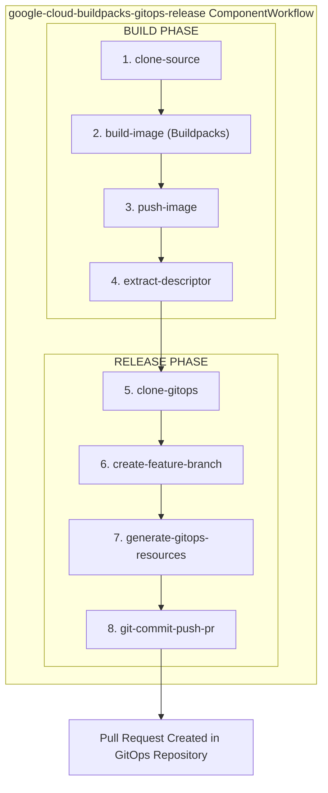

# GitOps Build and Release Workflow (Google Cloud Buildpacks)

This directory contains a ComponentWorkflow for automating the complete CI/CD pipeline using Google Cloud Buildpacks for building container images and creating pull requests in your GitOps repository.

## Overview

The `google-cloud-buildpacks-gitops-release` ComponentWorkflow automates:
1. Building a container image using Google Cloud Buildpacks (no Dockerfile required)
2. Pushing to a container registry
3. Generating deployment manifests (Workload, ComponentRelease, ReleaseBinding)
4. Creating a pull request in your GitOps repository

## Architecture



## Prerequisites

- OpenChoreo installed with build plane
- ClusterSecretStore configured (comes with OpenChoreo installation)
- GitOps repository with openchoreo manifests
> [!NOTE]  
> In the GitOps repository, it should have the manifests for the specified Project, Component, Deployment Pipeline, and Target Environment. A sample GitOps repository can be found in the [openchoreo/sample-gitops](https://github.com/openchoreo/sample-gitops) repository.
- GitHub Personal Access Token (PAT) with `repo` scope to access the GitOps repository
- Source code repository with a buildpacks-compatible application
- GitHub Personal Access Token (PAT) with `repo` scope to access the source repository

## Installation

### 1. Install the Workflow

```bash
# Apply the ClusterWorkflowTemplate and the ComponentWorkflow
kubectl apply -f samples/gitops-workflows/component-workflows/build-and-release/google-cloud-buildpacks/google-cloud-buildpacks-gitops-release-template.yaml
kubectl apply -f samples/gitops-workflows/component-workflows/build-and-release/google-cloud-buildpacks/google-cloud-buildpacks-gitops-release.yaml

# Verify installation
kubectl get clusterworkflowtemplate google-cloud-buildpacks-gitops-release
kubectl get componentworkflow google-cloud-buildpacks-gitops-release -n default
```

### 2. Configure Secrets in ClusterSecretStore

The workflow uses ExternalSecrets to automatically provision credentials. Add your tokens to the ClusterSecretStore:

> [!NOTE]
> The following commands use the `fake` provider, which is a placeholder for any external secret provider. This is only for development purposes. When deploying to production, use a real secret provider.

```bash
# Your GitHub PAT for source repository (only needed for private repos)
SOURCE_GIT_TOKEN="ghp_your_source_repo_token"

# Your GitHub PAT for GitOps repository (required - must have repo scope)
GITOPS_GIT_TOKEN="ghp_your_gitops_repo_token"

# Patch the ClusterSecretStore
kubectl patch clustersecretstore default --type='json' -p="[
  {
    \"op\": \"add\",
    \"path\": \"/spec/provider/fake/data/-\",
    \"value\": {
      \"key\": \"git-token\",
      \"value\": \"${SOURCE_GIT_TOKEN}\"
    }
  },
  {
    \"op\": \"add\",
    \"path\": \"/spec/provider/fake/data/-\",
    \"value\": {
      \"key\": \"gitops-token\",
      \"value\": \"${GITOPS_GIT_TOKEN}\"
    }
  }
]"

# Verify
kubectl get clustersecretstore default -o jsonpath='{.spec.provider.fake.data[*].key}' | tr ' ' '\n'
```

#### Required Secret Keys

| Key | Description | Used By |
|-----|-------------|---------|
| `git-token` | PAT for source repository (only needed for private repos) | `clone-source` step |
| `gitops-token` | PAT for GitOps repository (clone, push, PR creation) | `clone-gitops`, `git-commit-push-pr` steps |

## Usage

### Basic Build and Release

```yaml
apiVersion: openchoreo.dev/v1alpha1
kind: ComponentWorkflowRun
metadata:
  name: reading-list-service-gitops-build-release-001
  namespace: default
spec:
  owner:
    projectName: "demo-project-gitops"
    componentName: "reading-list-service-gitops"

  workflow:
    name: google-cloud-buildpacks-gitops-release

    systemParameters:
      repository:
        url: "https://github.com/openchoreo/sample-workloads/"
        revision:
          branch: "main"
        appPath: "/service-go-reading-list"

    parameters:
      buildpacks:
        builderImage: "gcr.io/buildpacks/builder:v1"
        env: []
      gitops:
        repositoryUrl: "https://github.com/openchoreo/sample-gitops"
        branch: "main"
        targetEnvironment: "development"
        deploymentPipeline: "standard"
      workloadDescriptorPath: "workload.yaml"
```

### With Build Environment Variables

```yaml
apiVersion: openchoreo.dev/v1alpha1
kind: ComponentWorkflowRun
metadata:
  name: my-app-build-release-002
  namespace: default
spec:
  owner:
    projectName: "demo-project"
    componentName: "my-node-service"

  workflow:
    name: google-cloud-buildpacks-gitops-release

    systemParameters:
      repository:
        url: "https://github.com/myorg/my-app"
        revision:
          branch: "main"
          commit: "abc123def456"
        appPath: "/services/my-node-service"

    parameters:
      buildpacks:
        builderImage: "gcr.io/buildpacks/builder:v1"
        env:
          - "NODE_ENV=production"
          - "NPM_CONFIG_PRODUCTION=true"
      gitops:
        repositoryUrl: "https://github.com/myorg/gitops-config"
        branch: "main"
        targetEnvironment: "staging"
        deploymentPipeline: "standard-pipeline"
      workloadDescriptorPath: "workload.yaml"
```

### Monitor Progress

```bash
# Watch the ComponentWorkflowRun status
kubectl get componentworkflowrun reading-list-service-gitops-build-release-001 -w

# View Argo Workflow status in the build plane
kubectl get workflow -n openchoreo-ci-default

# View logs for a specific step
kubectl logs -n openchoreo-ci-default -l workflows.argoproj.io/workflow=<workflow-name> --all-containers=true
```

## Parameters Reference

### System Parameters

| Parameter | Type | Required | Default | Description |
|-----------|------|----------|---------|-------------|
| `repository.url` | string | Yes | - | Git repository URL |
| `repository.revision.branch` | string | No | `main` | Git branch to checkout |
| `repository.revision.commit` | string | No | - | Git commit SHA (optional, defaults to latest) |
| `repository.appPath` | string | No | `.` | Path to the application directory |

### Buildpacks Configuration

| Parameter | Type | Required | Default | Description |
|-----------|------|----------|---------|-------------|
| `buildpacks.builderImage` | string | No | `gcr.io/buildpacks/builder:v1` | Buildpacks builder image to use |
| `buildpacks.env` | []string | No | `[]` | Environment variables for the build (KEY=VALUE format) |

### GitOps Configuration

| Parameter | Type | Required | Default | Description |
|-----------|------|----------|---------|-------------|
| `gitops.repositoryUrl` | string | Yes | - | GitOps repository URL |
| `gitops.branch` | string | No | `main` | GitOps repository branch |
| `gitops.targetEnvironment` | string | No | `development` | Target environment name |
| `gitops.deploymentPipeline` | string | Yes | - | Deployment pipeline name |

### Workload Descriptor

| Parameter | Type | Required | Default | Description |
|-----------|------|----------|---------|-------------|
| `workloadDescriptorPath` | string | No | `workload.yaml` | Path to workload descriptor relative to appPath |

## Supported Languages

Google Cloud Buildpacks automatically detect and build applications in many languages:

- Go
- Java (Maven, Gradle)
- Node.js (npm, yarn)
- Python (pip)
- .NET Core
- Ruby
- PHP

No Dockerfile required - buildpacks automatically detect the language and framework.

## Workflow Steps

| Step | Description | Output |
|------|-------------|--------|
| 1. `clone-source` | Clones the source repository | Git revision (short SHA) |
| 2. `build-image` | Builds image using Google Cloud Buildpacks | Container image tarball |
| 3. `push-image` | Pushes image to registry | Image reference |
| 4. `extract-descriptor` | Extracts workload descriptor from source | Base64-encoded descriptor |
| 5. `clone-gitops` | Clones the GitOps repository | GitOps workspace |
| 6. `create-feature-branch` | Creates a release branch | Branch name |
| 7. `generate-gitops-resources` | Generates Workload, ComponentRelease, and ReleaseBinding manifests using occ CLI | All GitOps manifests |
| 8. `git-commit-push-pr` | Commits changes, pushes to remote, and creates PR using GitHub CLI | PR URL |

## Troubleshooting

### Build Image Fails

- Verify the application is in a supported language
- Check that required files exist (e.g., `go.mod`, `package.json`, `requirements.txt`)
- Review buildpacks build logs for specific errors
- Ensure the builder image is accessible

### Clone Source Fails

- Verify the source repository URL is correct and accessible
- For private repos, ensure `git-token` is set in ClusterSecretStore
- Check that the branch/commit exists

### Clone GitOps Fails

- Verify GitOps repository URL is correct
- Ensure `gitops-token` is set in ClusterSecretStore with correct permissions
- Check that the branch exists in the GitOps repository

### Pull Request Not Created

- Verify GitHub token has `repo` scope
- Check that the base branch exists
- Review GitHub API rate limits
- Ensure the GitOps repository allows PR creation

## Files in This Directory

```
google-cloud-buildpacks/
├── README.md                                          # This file
├── google-cloud-buildpacks-gitops-release.yaml        # ComponentWorkflow CR
└── google-cloud-buildpacks-gitops-release-template.yaml # ClusterWorkflowTemplate (8 steps)
```

## Support

For issues or questions:
- GitHub Issues: https://github.com/openchoreo/openchoreo/issues
- Documentation: https://openchoreo.dev/docs
