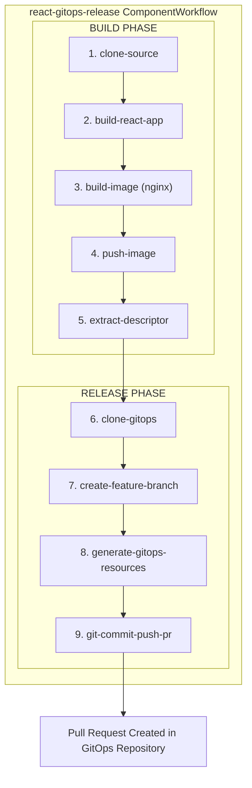

# GitOps Build and Release Workflow (React)

This directory contains a ComponentWorkflow for automating the complete CI/CD pipeline for React web applications, from building the application to creating pull requests in your GitOps repository.

## Overview

The `react-gitops-release` ComponentWorkflow automates:
1. Building a React application using Node.js
2. Packaging the build output into an image
3. Pushing to a container registry
4. Generating deployment manifests (Workload, ComponentRelease, ReleaseBinding)
5. Creating a pull request in your GitOps repository

## Architecture



## Prerequisites

- OpenChoreo installed with build plane
- ClusterSecretStore configured (comes with OpenChoreo installation)
- GitOps repository with openchoreo manifests
> [!NOTE]  
> In the GitOps repository, it should have the manifests for the specified Project, Component, Deployment Pipeline, and Target Environment. A sample GitOps repository can be found in the [openchoreo/sample-gitops](https://github.com/openchoreo/sample-gitops) repository.
- GitHub Personal Access Token (PAT) with `repo` scope to access the GitOps repository
- Source code repository with a React application
- GitHub Personal Access Token (PAT) with `repo` scope to access the source repository

## Installation

### 1. Install the Workflow

```bash
# Apply the ClusterWorkflowTemplate and the ComponentWorkflow
kubectl apply -f samples/gitops-workflows/component-workflows/build-and-release/react/react-gitops-release-template.yaml
kubectl apply -f samples/gitops-workflows/component-workflows/build-and-release/react/react-gitops-release.yaml

# Verify installation
kubectl get clusterworkflowtemplate react-gitops-release
kubectl get componentworkflow react-gitops-release -n default
```

### 2. Configure Secrets in ClusterSecretStore

The workflow uses ExternalSecrets to automatically provision credentials. Add your tokens to the ClusterSecretStore:

> [!NOTE]
> The following commands use the `fake` provider, which is a placeholder for any external secret provider. This is only for development purposes. When deploying to production, use a real secret provider.

```bash
# Your GitHub PAT for source repository (only needed for private repos)
SOURCE_GIT_TOKEN="ghp_your_source_repo_token"

# Your GitHub PAT for GitOps repository (required - must have repo scope)
GITOPS_GIT_TOKEN="ghp_your_gitops_repo_token"

# Patch the ClusterSecretStore
kubectl patch clustersecretstore default --type='json' -p="[
  {
    \"op\": \"add\",
    \"path\": \"/spec/provider/fake/data/-\",
    \"value\": {
      \"key\": \"git-token\",
      \"value\": \"${SOURCE_GIT_TOKEN}\"
    }
  },
  {
    \"op\": \"add\",
    \"path\": \"/spec/provider/fake/data/-\",
    \"value\": {
      \"key\": \"gitops-token\",
      \"value\": \"${GITOPS_GIT_TOKEN}\"
    }
  }
]"

# Verify
kubectl get clustersecretstore default -o jsonpath='{.spec.provider.fake.data[*].key}' | tr ' ' '\n'
```

#### Required Secret Keys

| Key | Description | Used By |
|-----|-------------|---------|
| `git-token` | PAT for source repository (only needed for private repos) | `clone-source` step |
| `gitops-token` | PAT for GitOps repository (clone, push, PR creation) | `clone-gitops`, `git-commit-push-pr` steps |

## Usage

### Basic Build and Release

```yaml
apiVersion: openchoreo.dev/v1alpha1
kind: ComponentWorkflowRun
metadata:
  name: react-starter-gitops-build-release-001
  namespace: default
spec:
  owner:
    projectName: "demo-project-gitops"
    componentName: "react-starter-gitops"

  workflow:
    name: react-gitops-release

    systemParameters:
      repository:
        url: "https://github.com/openchoreo/sample-workloads"
        revision:
          branch: "main"
        appPath: "/webapp-react-nginx"

    parameters:
      react:
        nodeVersion: "20"
        buildCommand: "npm run build"
        outputDir: "build"
      gitops:
        repositoryUrl: "https://github.com/openchoreo/sample-gitops"
        branch: "main"
        targetEnvironment: "development"
        deploymentPipeline: "standard"
      workloadDescriptorPath: "workload.yaml"
```

### Monitor Progress

```bash
# Watch the ComponentWorkflowRun status
kubectl get componentworkflowrun react-starter-gitops-build-release-001 -w

# View Argo Workflow status in the build plane
kubectl get workflow -n openchoreo-ci-default

# View logs for a specific step
kubectl logs -n openchoreo-ci-default -l workflows.argoproj.io/workflow=<workflow-name> --all-containers=true
```

## Parameters Reference

### System Parameters

| Parameter | Type | Required | Default | Description |
|-----------|------|----------|---------|-------------|
| `repository.url` | string | Yes | - | Git repository URL |
| `repository.revision.branch` | string | No | `main` | Git branch to checkout |
| `repository.revision.commit` | string | No | - | Git commit SHA (optional, defaults to latest) |
| `repository.appPath` | string | No | `.` | Path to the React application directory |

### React Configuration

| Parameter | Type | Required | Default | Description |
|-----------|------|----------|---------|-------------|
| `react.nodeVersion` | string | No | `18` | Node.js version (16, 18, 20, 22) |
| `react.buildCommand` | string | No | `npm run build` | Command to build the React application |
| `react.outputDir` | string | No | `build` | Build output directory (e.g., build, dist) |

### GitOps Configuration

| Parameter | Type | Required | Default | Description |
|-----------|------|----------|---------|-------------|
| `gitops.repositoryUrl` | string | Yes | - | GitOps repository URL |
| `gitops.branch` | string | No | `main` | GitOps repository branch |
| `gitops.targetEnvironment` | string | No | `development` | Target environment name |
| `gitops.deploymentPipeline` | string | Yes | - | Deployment pipeline name |

### Workload Descriptor

| Parameter | Type | Required | Default | Description |
|-----------|------|----------|---------|-------------|
| `workloadDescriptorPath` | string | No | `workload.yaml` | Path to workload descriptor relative to appPath |

## Supported Node.js Versions

The workflow supports the following Node.js versions:
- Node.js 16 (LTS)
- Node.js 18 (LTS) - Default
- Node.js 20 (LTS)
- Node.js 22 (Current)

## Workflow Steps

| Step | Description | Output |
|------|-------------|--------|
| 1. `clone-source` | Clones the source repository | Git revision (short SHA) |
| 2. `build-react-app` | Installs dependencies and builds React app | Build output directory |
| 3. `build-image` | Packages build output into nginx container | Container image tarball |
| 4. `push-image` | Pushes image to registry | Image reference |
| 5. `extract-descriptor` | Extracts workload descriptor from source | Base64-encoded descriptor |
| 6. `clone-gitops` | Clones the GitOps repository | GitOps workspace |
| 7. `create-feature-branch` | Creates a release branch | Branch name |
| 8. `generate-gitops-resources` | Generates Workload, ComponentRelease, and ReleaseBinding manifests using occ CLI | All GitOps manifests |
| 9. `git-commit-push-pr` | Commits changes, pushes to remote, and creates PR using GitHub CLI | PR URL |

## Container Image

The workflow produces an nginx-based container image that:
- Serves the React build output as static files
- Includes SPA (Single Page Application) routing support
- Exposes port 80

The nginx configuration handles client-side routing by redirecting all requests to `index.html`.

## Troubleshooting

### Build React App Fails

- Verify `package.json` exists in the app path
- Check that the build command is correct
- Ensure all dependencies are listed in `package.json`
- Review Node.js version compatibility

### Clone Source Fails

- Verify the source repository URL is correct and accessible
- For private repos, ensure `git-token` is set in ClusterSecretStore
- Check that the branch/commit exists

### Build Image Fails

- Verify the build output directory exists after the build step
- Check that the output directory name matches `outputDir` parameter

### Clone GitOps Fails

- Verify GitOps repository URL is correct
- Ensure `gitops-token` is set in ClusterSecretStore with correct permissions
- Check that the branch exists in the GitOps repository

### Pull Request Not Created

- Verify GitHub token has `repo` scope
- Check that the base branch exists
- Review GitHub API rate limits
- Ensure the GitOps repository allows PR creation

## Files in This Directory

```
react/
├── README.md                          # This file
├── react-gitops-release.yaml          # ComponentWorkflow CR
└── react-gitops-release-template.yaml # ClusterWorkflowTemplate (9 steps)
```

## Support

For issues or questions:
- GitHub Issues: https://github.com/openchoreo/openchoreo/issues
- Documentation: https://openchoreo.dev/docs
