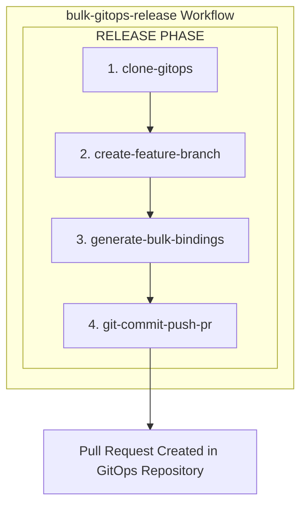

# Bulk GitOps Release Workflow

This directory contains a Workflow for automating bulk releases of components when using OpenChoreo with GitOps. This Workflow can release all components across all projects or all components within a specific project in the given GitOps repository.

## Overview

The `bulk-gitops-release` Workflow automates:
1. Cloning the GitOps repository
2. Creating a feature branch for the bulk release
3. Generating/Updating ReleaseBindings targeting a specified environment
4. Creating a pull request in your GitOps repository

## Architecture



## Prerequisites

- OpenChoreo installed with build plane
- ClusterSecretStore configured (comes with OpenChoreo installation)
- GitOps repository with OpenChoreo manifests
> [!NOTE]
> The GitOps repository should contain manifests for Projects, Components, Deployment Pipelines, and Target Environments. Each component should have an existing Workload manifest. A sample GitOps repository can be found in the [openchoreo/sample-gitops](https://github.com/openchoreo/sample-gitops) repository.
> At the moment, this workflow only supports with **GitHub** as the GitOps repository.
- GitHub Personal Access Token (PAT) with `repo` scope to access the GitOps repository

## Installation

### 1. Install the Workflow

```bash
# Apply the ClusterWorkflowTemplate and the Workflow
kubectl apply -f samples/gitops-workflows/workflows/bulk-release/bulk-gitops-release-template.yaml
kubectl apply -f samples/gitops-workflows/workflows/bulk-release/bulk-gitops-release.yaml

# Verify installation
kubectl get clusterworkflowtemplate bulk-gitops-release
kubectl get workflow bulk-gitops-release -n default
```

### 2. Configure Secrets in ClusterSecretStore

The workflow uses `ExternalSecrets` to automatically provision credentials. Add your tokens to the ClusterSecretStore:

> [!NOTE]
> The following commands use the `fake` provider, which is a placeholder for any external secret provider. This is only for development purposes. When deploying to production, use a real secret provider.

```bash
# Your GitHub PAT for GitOps repository (required - must have repo scope)
GITOPS_GIT_TOKEN="ghp_your_gitops_repo_token"

# Patch the ClusterSecretStore
kubectl patch clustersecretstore default --type='json' -p="[
  {
    \"op\": \"add\",
    \"path\": \"/spec/provider/fake/data/-\",
    \"value\": {
      \"key\": \"gitops-token\",
      \"value\": \"${GITOPS_GIT_TOKEN}\"
    }
  }
]"

# Verify
kubectl get clustersecretstore default -o jsonpath='{.spec.provider.fake.data[*].key}' | tr ' ' '\n'
```

#### Required Secret Keys

| Key | Description | Used By |
|-----|-------------|---------|
| `gitops-token` | PAT for GitOps repository (clone, push, PR creation) | `clone-gitops`, `git-commit-push-pr` steps |

## Usage

### Release All Components Across All Projects

```yaml
apiVersion: openchoreo.dev/v1alpha1
kind: WorkflowRun
metadata:
  name: bulk-release-all-001
  namespace: default
spec:
  workflow:
    name: bulk-gitops-release

    parameters:
      scope:
        all: true
      gitops:
        repositoryUrl: "https://github.com/<your_org>/<repo_name>"
        branch: "main"
        targetEnvironment: "development"
        deploymentPipeline: "default-pipeline"
```

### Release Components for a Specific Project

```yaml
apiVersion: openchoreo.dev/v1alpha1
kind: WorkflowRun
metadata:
  name: bulk-release-project-001
  namespace: default
spec:
  workflow:
    name: bulk-gitops-release

    parameters:
      scope:
        all: false
        projectName: "demo-project"
      gitops:
        repositoryUrl: "https://github.com/<your_org>/<repo_name>"
        branch: "main"
        targetEnvironment: "staging"
        deploymentPipeline: "default-pipeline"
```

### Monitor Progress

```bash
# Watch the WorkflowRun status
kubectl get workflowrun bulk-release-all-001 -w

# View Argo Workflow status in the build plane
kubectl get workflow -n openchoreo-ci-default

# View logs for a specific step
kubectl logs -n openchoreo-ci-default -l workflows.argoproj.io/workflow=<workflow-name> --all-containers=true
```

## Parameters Reference

### Scope Configuration

| Parameter | Type | Required | Default | Description |
|-----------|------|----------|---------|-------------|
| `scope.all` | boolean | No | `false` | Release all components across all projects |
| `scope.projectName` | string | No | - | Project name to release (ignored if `all=true`) |

### GitOps Configuration

| Parameter | Type | Required | Default | Description |
|-----------|------|----------|---------|-------------|
| `gitops.repositoryUrl` | string | Yes | - | GitOps repository URL |
| `gitops.branch` | string | No | `main` | GitOps repository branch |
| `gitops.targetEnvironment` | string | No | `development` | Target environment name for deployment |
| `gitops.deploymentPipeline` | string | Yes | - | Deployment pipeline name for the target environment |

## Workflow Steps

| Step | Description | Output |
|------|-------------|--------|
| 1. `clone-gitops` | Clones the GitOps repository | GitOps workspace |
| 2. `create-feature-branch` | Creates a release branch (`bulk-release/all-*` or `bulk-release/<project>-*`) | Branch name |
| 3. `generate-bulk-bindings` | Generates ReleaseBindings for all components using `occ releasebinding generate` | ReleaseBinding manifests |
| 4. `git-commit-push-pr` | Commits changes, pushes to remote, and creates PR using GitHub CLI | PR URL |

## CLI Commands Used

The workflow internally uses the following `occ` CLI commands:

```bash
# For all components across all projects
occ releasebinding generate --all --target-env <env> --use-pipeline <pipeline>

# For a specific project
occ releasebinding generate --project <project> --target-env <env> --use-pipeline <pipeline>
```

## Workflow Outputs

The workflow produces:

1. **ReleaseBindings**: Links each component release to the target environment and deployment pipeline
2. **Pull Request**: Created in the GitOps repository for review and approval

## Troubleshooting

### Clone GitOps Fails

- Verify GitOps repository URL is correct
- Ensure `gitops-token` is set in ClusterSecretStore with correct permissions
- Check that the branch exists in the GitOps repository

### Generate Bulk Bindings Fails

- Verify the target environment exists in the GitOps repository
- Ensure the deployment pipeline is configured correctly
- Check that ComponentReleases exist for the components
- Check the occ CLI logs for specific errors

### Git Push Fails

**Error: `Invalid username or token`**
- The GitHub PAT may be expired, revoked, or lacks permissions
- Ensure the token has `repo` scope
- Regenerate the token and update ClusterSecretStore

**Error: `could not read Password`**
- The token URL format may be incorrect
- Ensure the workflow template uses `x-access-token:TOKEN@` format

### Pull Request Not Created

- Verify GitHub token has `repo` scope
- Check that the base branch exists
- Review GitHub API rate limits
- Ensure the GitOps repository allows PR creation

### No Changes to Commit

If the workflow reports "No changes to commit", this means:
- All ReleaseBindings are already up to date
- This is not an error - it indicates the GitOps repository is already in sync

### ExternalSecrets Not Syncing

```bash
# Check ExternalSecrets status
kubectl get externalsecret -n openchoreo-ci-default

# Verify ClusterSecretStore has required keys
kubectl get clustersecretstore default -o jsonpath='{.spec.provider.fake.data[*].key}'
```

## Files in This Directory

```
bulk-release/
├── README.md                           # This file
├── bulk-gitops-release.yaml            # Workflow CR
└── bulk-gitops-release-template.yaml   # ClusterWorkflowTemplate (4 steps)
```

## Support

For issues or questions:
- GitHub Issues: https://github.com/openchoreo/openchoreo/issues
- Documentation: https://openchoreo.dev/docs
